# Sequence Diagrams - EduCen API

## Mục lục
0. [Tổng quan hệ thống](#0-tổng-quan-hệ-thống)
1. [Đăng ký & Đăng nhập](#1-đăng-ký--đăng-nhập)
2. [Đăng ký Tenant](#2-đăng-ký-tenant)
3. [Xử lý yêu cầu ghi danh](#3-xử-lý-yêu-cầu-ghi-danh)
4. [Thanh toán](#4-thanh-toán)
5. [Quản lý học sinh](#5-quản-lý-học-sinh)
6. [Điểm danh](#6-điểm-danh)
7. [Hoàn tiền](#7-hoàn-tiền)
8. [Thông báo](#8-thông-báo)
9. [Quản lý lớp học](#9-quản-lý-lớp-học)
10. [Quản lý đăng ký gói](#10-quản-lý-đăng-ký-gói)
11. [Quản lý học phí & Hóa đơn](#11-quản-lý-học-phí--hóa-đơn)
12. [Yêu cầu hỗ trợ](#12-yêu-cầu-hỗ-trợ)
13. [Quản lý bài tập & Nộp bài](#13-quản-lý-bài-tập--nộp-bài)

---

## 0. Tổng quan hệ thống

### Sơ đồ kiến trúc tổng thể

```mermaid
flowchart TB
    subgraph Client["Frontend Clients"]
        Web["Web App"]
        Mobile["Mobile App"]
    end

    subgraph API["EduCen API"]
        Auth["AuthController"]
        Tenant["TenantsController"]
        Sub["SubscriptionController"]
        Student["StudentsController"]
        Class["ClassesController"]
        Attend["AttendanceController"]
        Payment["PaymentsController"]
        Tuition["TuitionController"]
        Invoice["FamilyInvoiceController"]
        Notify["NotificationsController"]
        Enroll["EnrollmentRequestsController"]
        Refund["RefundsController"]
        Support["SupportRequestsController"]
        Schedule["SchedulesController"]
        Grade["GradesController"]
        Assign["AssignmentsController"]
        Subject["SubjectsController"]
        Teacher["TeachersController"]
        Assistant["AssistantsController"]
        Parent["ParentsController"]
    end

    subgraph Services["Business Services"]
        AuthS["AuthService"]
        TenantS["TenantService"]
        SubS["SubscriptionService"]
        StudentS["StudentService"]
        ClassS["ClassService"]
        AttendS["AttendanceService"]
        PaymentS["PaymentService"]
        TuitionS["TuitionService"]
        InvoiceS["InvoiceService"]
        NotifyS["PaymentReminderService"]
        EnrollS["EnrollmentRequestService"]
        RefundS["RefundService"]
        SupportS["SupportRequestsService"]
    end

    subgraph External["External Services"]
        VNPay["VNPay Gateway"]
        Zalo["Zalo OA"]
        Email["Mail Service"]
    end

    subgraph Database["Databases"]
        AdminDB["Admin DB (Tenants, Subscriptions)"]
        TenantDB["Tenant DB (Per Tenant)"]
    end

    Client --> API
    API --> Services
    Services --> External
    Services --> Database
```

### Sequence Diagram Tổng quan - Luồng chính

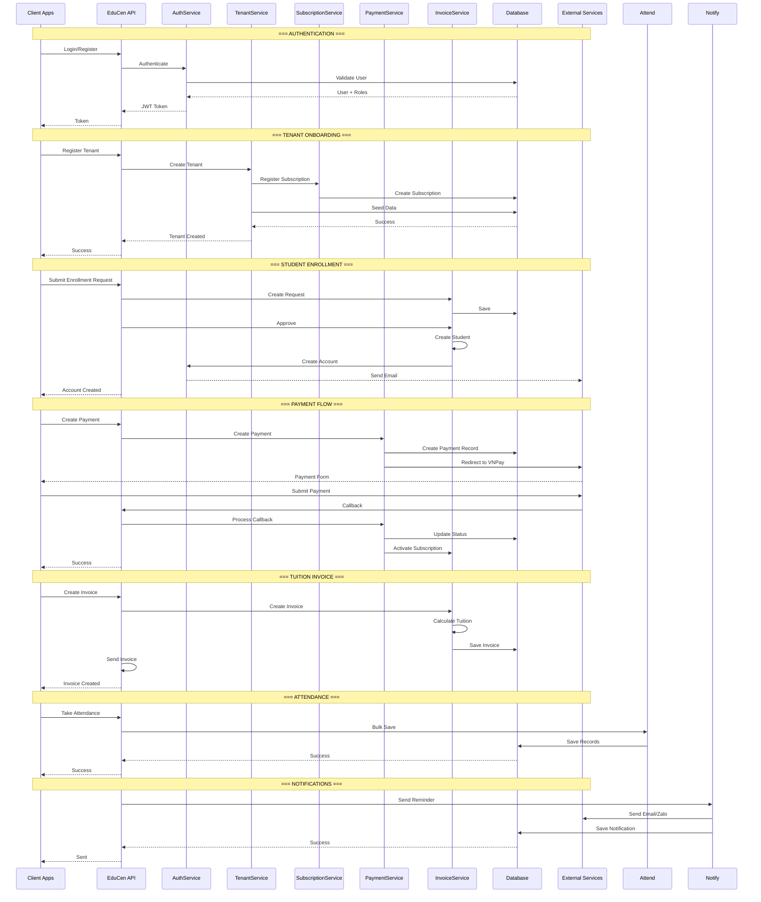
```mermaid
sequenceDiagram
    participant Client as Client Apps
    participant API as EduCen API
    participant Auth as AuthService
    participant Tenant as TenantService
    participant Sub as SubscriptionService
    participant Payment as PaymentService
    participant Invoice as InvoiceService
    participant DB as Database
    participant External as External Services

    Note over Client, External: === AUTHENTICATION ===
    Client->>API: Login/Register
    API->>Auth: Authenticate
    Auth->>DB: Validate User
    DB-->>Auth: User + Roles
    Auth-->>API: JWT Token
    API-->>Client: Token

    Note over Client, External: === TENANT ONBOARDING ===
    Client->>API: Register Tenant
    API->>Tenant: Create Tenant
    Tenant->>Sub: Register Subscription
    Sub->>DB: Create Subscription
    Tenant->>DB: Seed Data
    DB-->>Tenant: Success
    Tenant-->>API: Tenant Created
    API-->>Client: Success

    Note over Client, External: === STUDENT ENROLLMENT ===
    Client->>API: Submit Enrollment Request
    API->>Invoice: Create Request
    Invoice->>DB: Save
    API->>Invoice: Approve
    Invoice->>Invoice: Create Student
    Invoice->>Auth: Create Account
    Auth-->>External: Send Email
    API-->>Client: Account Created

    Note over Client, External: === PAYMENT FLOW ===
    Client->>API: Create Payment
    API->>Payment: Create Payment
    Payment->>DB: Create Payment Record
    Payment->>External: Redirect to VNPay
    External-->>Client: Payment Form
    Client->>External: Submit Payment
    External->>API: Callback
    API->>Payment: Process Callback
    Payment->>DB: Update Status
    Payment->>Invoice: Activate Subscription
    API-->>Client: Success

    Note over Client, External: === TUITION INVOICE ===
    Client->>API: Create Invoice
    API->>Invoice: Create Invoice
    Invoice->>Invoice: Calculate Tuition
    Invoice->>DB: Save Invoice
    API->>API: Send Invoice
    API-->>Client: Invoice Created

    Note over Client, External: === ATTENDANCE ===
    Client->>API: Take Attendance
    API->>Attend: Bulk Save
    Attend->>DB: Save Records
    DB-->>API: Success
    API-->>Client: Success

    Note over Client, External: === NOTIFICATIONS ===
    API->>Notify: Send Reminder
    Notify->>External: Send Email/Zalo
    Notify->>DB: Save Notification
    DB-->>API: Success
    API-->>Client: Sent
```

### Bản đồ Controllers và Services

| Controller | Service | Mô tả |
|------------|---------|-------|
| AuthController | IAuthService | Đăng ký, Đăng nhập, Reset Password |
| TenantsController | ITenantService | Quản lý Tenant |
| TenantRegistrationsController | ITenantRegistrationService | Đăng ký Tenant mới |
| SubscriptionController | ISubscriptionService | Quản lý gói dịch vụ |
| StudentsController | IStudentService | Quản lý học sinh |
| ClassesController | IClassService | Quản lý lớp học |
| AttendanceController | IAttendanceService | Điểm danh |
| PaymentsController | IPaymentService | Thanh toán |
| TuitionController | ITuitionService, IInvoiceService | Học phí, Hóa đơn |
| FamilyInvoiceController | IInvoiceService | Hóa đơn gia đình |
| NotificationsController | IPaymentReminderService | Thông báo |
| EnrollmentRequestsController | IEnrollmentRequestService | Yêu cầu ghi danh |
| RefundsController | IRefundService | Hoàn tiền |
| AssignmentsController | IAssignmentService | Bài tập |
| SubmissionController | ISubmissionService | Nộp bài |
| GradesController | IGradeService | Điểm số |
| SchedulesController | IScheduleService | Lịch học |
| SubjectsController | ISubjectService | Môn học |
| TeachersController | ITeacherService | Giáo viên |
| AssistantsController | IAssistantService | Trợ giảng |
| ParentsController | IParentService | Phụ huynh |
| SupportRequestsController | ISupportRequestsService | Yêu cầu hỗ trợ |

---

## 1. Đăng ký & Đăng nhập

### 1.1 Đăng ký tài khoản (Register)

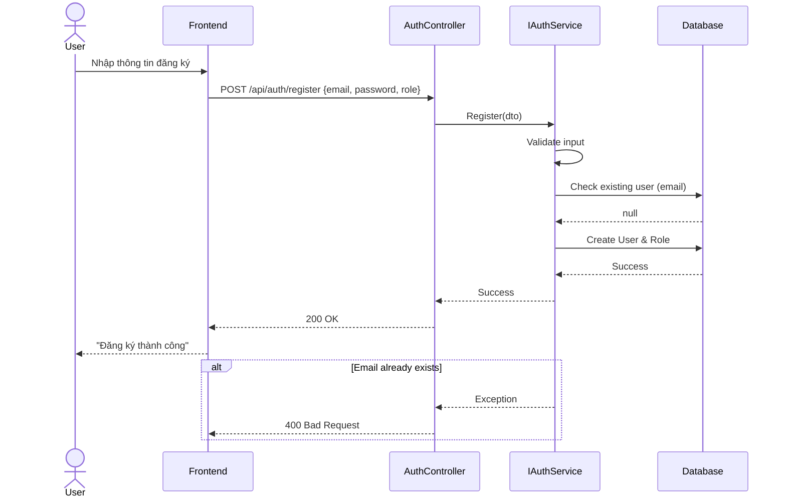
```mermaid
sequenceDiagram
    actor User
    participant Frontend
    participant AuthController as AuthController
    participant IAuthService as IAuthService
    participant Database as Database

    User->>Frontend: Nhập thông tin đăng ký
    Frontend->>AuthController: POST /api/auth/register {email, password, role}
    AuthController->>IAuthService: Register(dto)
    IAuthService->>IAuthService: Validate input
    IAuthService->>Database: Check existing user (email)
    Database-->>IAuthService: null
    IAuthService->>Database: Create User & Role
    Database-->>IAuthService: Success
    IAuthService-->>AuthController: Success
    AuthController-->>Frontend: 200 OK
    Frontend-->>User: "Đăng ký thành công"
    
    alt Email already exists
        IAuthService-->>AuthController: Exception
        AuthController-->>Frontend: 400 Bad Request
    end
```

### Class Diagram - Đăng ký & Đăng nhập

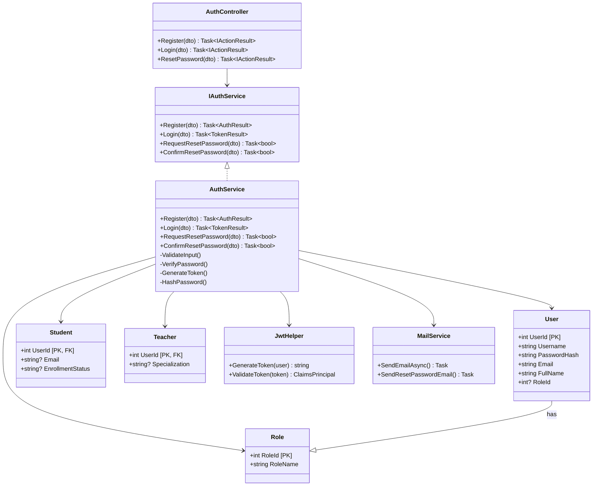
```mermaid
classDiagram
    class AuthController {
        +Register(dto) Task~IActionResult~
        +Login(dto) Task~IActionResult~
        +ResetPassword(dto) Task~IActionResult~
    }

    class IAuthService {
        +Register(dto) Task~AuthResult~
        +Login(dto) Task~TokenResult~
        +RequestResetPassword(dto) Task~bool~
        +ConfirmResetPassword(dto) Task~bool~
    }

    class AuthService {
        +Register(dto) Task~AuthResult~
        +Login(dto) Task~TokenResult~
        +RequestResetPassword(dto) Task~bool~
        +ConfirmResetPassword(dto) Task~bool~
        -ValidateInput()
        -VerifyPassword()
        -GenerateToken()
        -HashPassword()
    }

    class User {
        +int UserId [PK]
        +string Username
        +string PasswordHash
        +string Email
        +string FullName
        +int? RoleId
    }

    class Role {
        +int RoleId [PK]
        +string RoleName
    }

    class Student {
        +int UserId [PK, FK]
        +string? Email
        +string? EnrollmentStatus
    }

    class Teacher {
        +int UserId [PK, FK]
        +string? Specialization
    }

    class JwtHelper {
        +GenerateToken(user) string
        +ValidateToken(token) ClaimsPrincipal
    }

    class MailService {
        +SendEmailAsync() Task
        +SendResetPasswordEmail() Task
    }

    AuthController --> IAuthService
    IAuthService <|.. AuthService
    AuthService --> User
    AuthService --> Role
    AuthService --> Student
    AuthService --> Teacher
    AuthService --> JwtHelper
    AuthService --> MailService
    User --|> Role : has
```

### 1.2 Đăng nhập (Login)

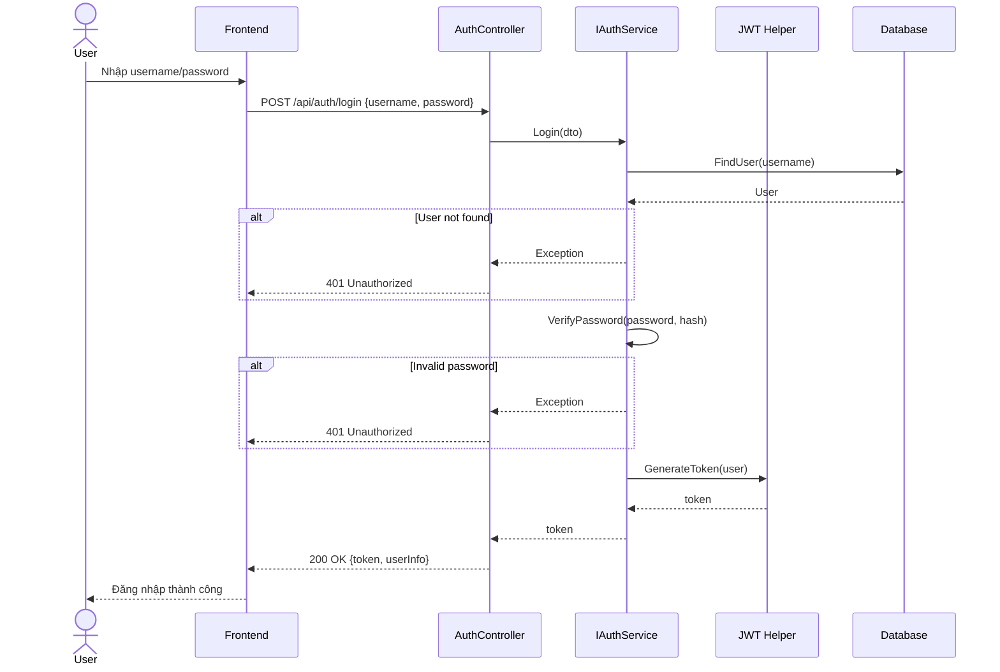
```mermaid
sequenceDiagram
    actor User
    participant Frontend
    participant AuthController as AuthController
    participant IAuthService as IAuthService
    participant JwtHelper as JWT Helper
    participant Database as Database

    User->>Frontend: Nhập username/password
    Frontend->>AuthController: POST /api/auth/login {username, password}
    AuthController->>IAuthService: Login(dto)
    IAuthService->>Database: FindUser(username)
    Database-->>IAuthService: User
    alt User not found
        IAuthService-->>AuthController: Exception
        AuthController-->>Frontend: 401 Unauthorized
    end
    IAuthService->>IAuthService: VerifyPassword(password, hash)
    alt Invalid password
        IAuthService-->>AuthController: Exception
        AuthController-->>Frontend: 401 Unauthorized
    end
    IAuthService->>JwtHelper: GenerateToken(user)
    JwtHelper-->>IAuthService: token
    IAuthService-->>AuthController: token
    AuthController-->>Frontend: 200 OK {token, userInfo}
    Frontend-->>User: Đăng nhập thành công
```

### Class Diagram - 1.2 Đăng nhập

### Class Diagram - 1.2 Đăng nhập

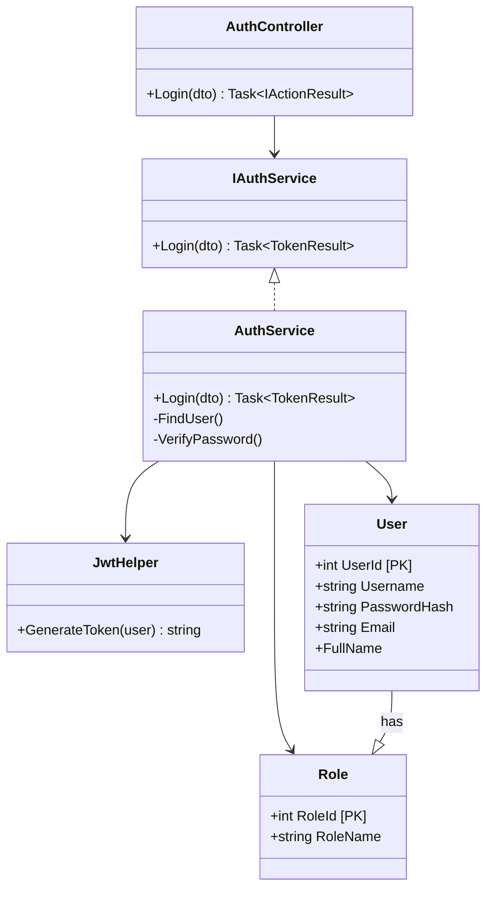
```mermaid
classDiagram
    class AuthController {
        +Login(dto) Task~IActionResult~
    }

    class IAuthService {
        +Login(dto) Task~TokenResult~
    }

    class AuthService {
        +Login(dto) Task~TokenResult~
        -FindUser()
        -VerifyPassword()
    }

    class JwtHelper {
        +GenerateToken(user) string
    }

    class User {
        +int UserId [PK]
        +string Username
        +string PasswordHash
        +string Email
        +FullName
    }

    class Role {
        +int RoleId [PK]
        +string RoleName
    }

    AuthController --> IAuthService
    IAuthService <|.. AuthService
    AuthService --> JwtHelper
    AuthService --> User
    AuthService --> Role
    User --|> Role : has
```

### 1.3 Reset Password

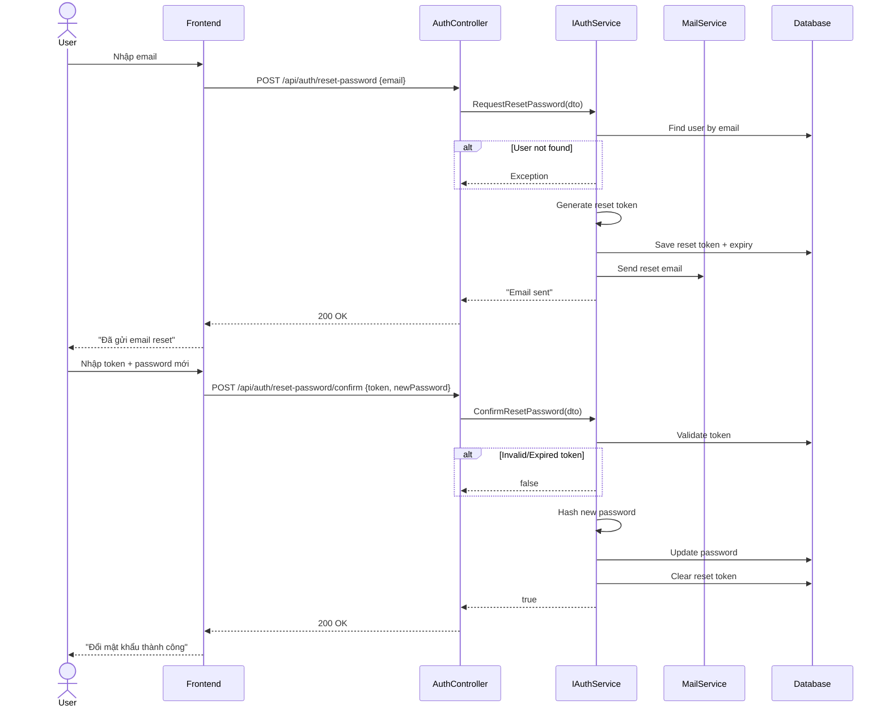
```mermaid
sequenceDiagram
    actor User
    participant Frontend
    participant AuthController as AuthController
    participant IAuthService as IAuthService
    participant MailService as MailService
    participant Database as Database

    User->>Frontend: Nhập email
    Frontend->>AuthController: POST /api/auth/reset-password {email}
    AuthController->>IAuthService: RequestResetPassword(dto)
    IAuthService->>Database: Find user by email
    alt User not found
        IAuthService-->>AuthController: Exception
    end
    IAuthService->>IAuthService: Generate reset token
    IAuthService->>Database: Save reset token + expiry
    IAuthService->>MailService: Send reset email
    IAuthService-->>AuthController: "Email sent"
    AuthController-->>Frontend: 200 OK
    Frontend-->>User: "Đã gửi email reset"

    User->>Frontend: Nhập token + password mới
    Frontend->>AuthController: POST /api/auth/reset-password/confirm {token, newPassword}
    AuthController->>IAuthService: ConfirmResetPassword(dto)
    IAuthService->>Database: Validate token
    alt Invalid/Expired token
        IAuthService-->>AuthController: false
    end
    IAuthService->>IAuthService: Hash new password
    IAuthService->>Database: Update password
    IAuthService->>Database: Clear reset token
    IAuthService-->>AuthController: true
    AuthController-->>Frontend: 200 OK
    Frontend-->>User: "Đổi mật khẩu thành công"
```

### Class Diagram - 1.3 Reset Password

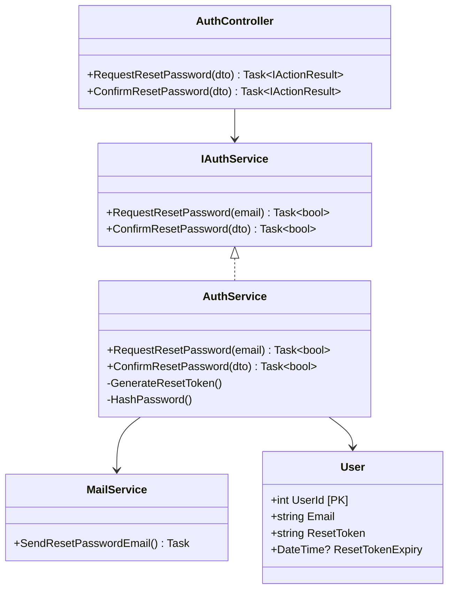
```mermaid
classDiagram
    class AuthController {
        +RequestResetPassword(dto) Task~IActionResult~
        +ConfirmResetPassword(dto) Task~IActionResult~
    }

    class IAuthService {
        +RequestResetPassword(email) Task~bool~
        +ConfirmResetPassword(dto) Task~bool~
    }

    class AuthService {
        +RequestResetPassword(email) Task~bool~
        +ConfirmResetPassword(dto) Task~bool~
        -GenerateResetToken()
        -HashPassword()
    }

    class MailService {
        +SendResetPasswordEmail() Task
    }

    class User {
        +int UserId [PK]
        +string Email
        +string ResetToken
        +DateTime? ResetTokenExpiry
    }

    AuthController --> IAuthService
    IAuthService <|.. AuthService
    AuthService --> MailService
    AuthService --> User
```

---

## 2. Đăng ký Tenant

### 2.1 Khách đăng ký tenant

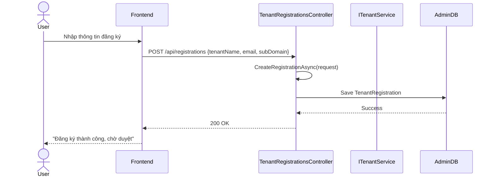
```mermaid
sequenceDiagram
    actor User
    participant Frontend
    participant TenantRegController as TenantRegistrationsController
    participant TenantService as ITenantService
    participant Database as AdminDB

    User->>Frontend: Nhập thông tin đăng ký
    Frontend->>TenantRegController: POST /api/registrations {tenantName, email, subDomain}
    TenantRegController->>TenantRegController: CreateRegistrationAsync(request)
    TenantRegController->>Database: Save TenantRegistration
    Database-->>TenantRegController: Success
    TenantRegController-->>Frontend: 200 OK
    Frontend-->>User: "Đăng ký thành công, chờ duyệt"
```

### 2.2 SystemAdmin duyệt tenant

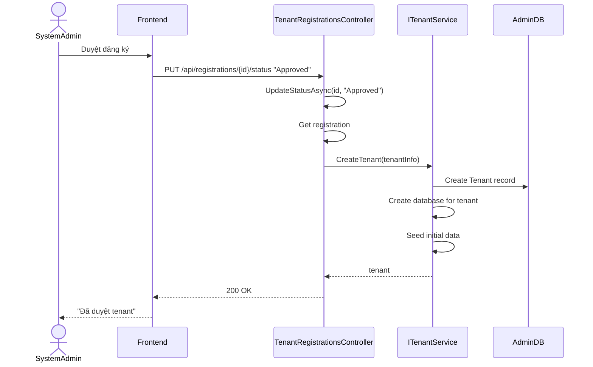
```mermaid
sequenceDiagram
    actor SystemAdmin
    participant Frontend
    participant TenantRegController as TenantRegistrationsController
    participant TenantService as ITenantService
    participant Database as AdminDB

    SystemAdmin->>Frontend: Duyệt đăng ký
    Frontend->>TenantRegController: PUT /api/registrations/{id}/status "Approved"
    TenantRegController->>TenantRegController: UpdateStatusAsync(id, "Approved")
    TenantRegController->>TenantRegController: Get registration
    TenantRegController->>TenantService: CreateTenant(tenantInfo)
    TenantService->>Database: Create Tenant record
    TenantService->>TenantService: Create database for tenant
    TenantService->>TenantService: Seed initial data
    TenantService-->>TenantRegController: tenant
    TenantRegController-->>Frontend: 200 OK
    Frontend-->>SystemAdmin: "Đã duyệt tenant"
```

### Class Diagram - 2. Đăng ký Tenant

### Class Diagram - Đăng ký Tenant

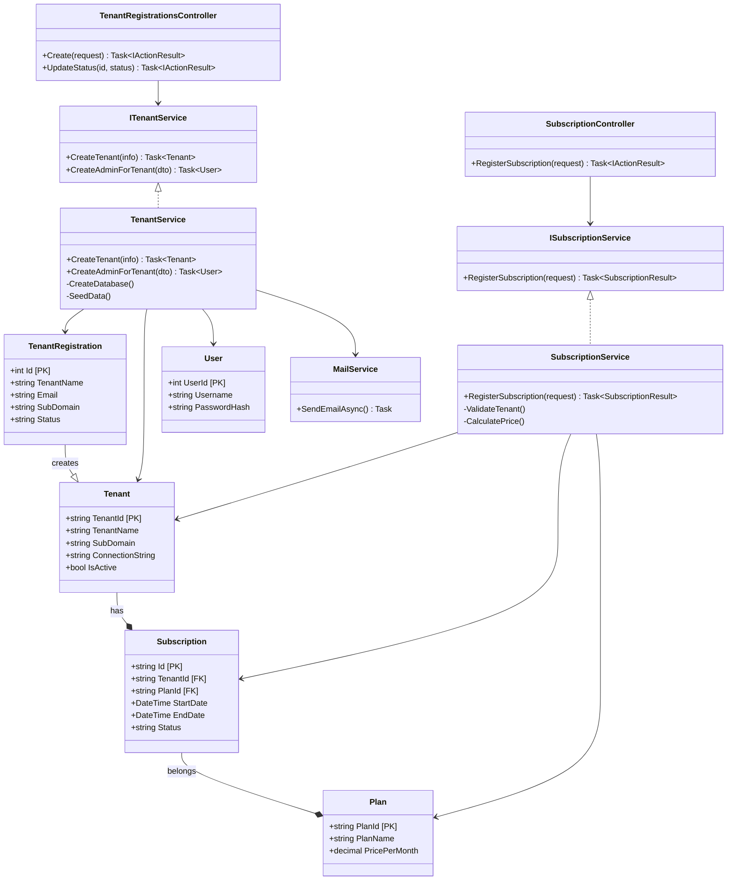
```mermaid
classDiagram
    class TenantRegistrationsController {
        +Create(request) Task~IActionResult~
        +UpdateStatus(id, status) Task~IActionResult~
    }

    class ITenantService {
        +CreateTenant(info) Task~Tenant~
        +CreateAdminForTenant(dto) Task~User~
    }

    class TenantService {
        +CreateTenant(info) Task~Tenant~
        +CreateAdminForTenant(dto) Task~User~
        -CreateDatabase()
        -SeedData()
    }

    class SubscriptionController {
        +RegisterSubscription(request) Task~IActionResult~
    }

    class ISubscriptionService {
        +RegisterSubscription(request) Task~SubscriptionResult~
    }

    class SubscriptionService {
        +RegisterSubscription(request) Task~SubscriptionResult~
        -ValidateTenant()
        -CalculatePrice()
    }

    class TenantRegistration {
        +int Id [PK]
        +string TenantName
        +string Email
        +string SubDomain
        +string Status
    }

    class Tenant {
        +string TenantId [PK]
        +string TenantName
        +string SubDomain
        +string ConnectionString
        +bool IsActive
    }

    class Subscription {
        +string Id [PK]
        +string TenantId [FK]
        +string PlanId [FK]
        +DateTime StartDate
        +DateTime EndDate
        +string Status
    }

    class Plan {
        +string PlanId [PK]
        +string PlanName
        +decimal PricePerMonth
    }

    class User {
        +int UserId [PK]
        +string Username
        +string PasswordHash
    }

    class MailService {
        +SendEmailAsync() Task
    }

    TenantRegistrationsController --> ITenantService
    ITenantService <|.. TenantService
    TenantService --> TenantRegistration
    TenantService --> Tenant
    TenantService --> User
    TenantService --> MailService
    SubscriptionController --> ISubscriptionService
    ISubscriptionService <|.. SubscriptionService
    SubscriptionService --> Tenant
    SubscriptionService --> Subscription
    SubscriptionService --> Plan
    TenantRegistration --|> Tenant : creates
    Tenant --* Subscription : has
    Subscription --* Plan : belongs
```

---

## 3. Xử lý yêu cầu ghi danh

### 3.1 Khách gửi yêu cầu ghi danh

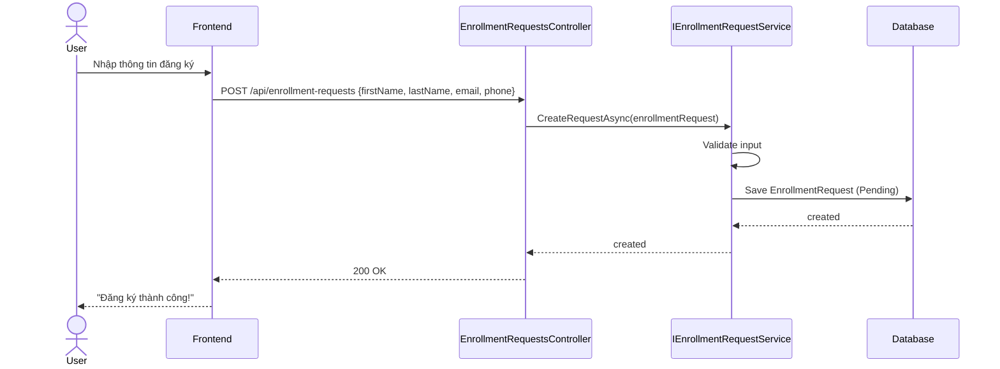
```mermaid
sequenceDiagram
    actor User
    participant Frontend
    participant EnrollController as EnrollmentRequestsController
    participant EnrollService as IEnrollmentRequestService
    participant Database as Database

    User->>Frontend: Nhập thông tin đăng ký
    Frontend->>EnrollController: POST /api/enrollment-requests {firstName, lastName, email, phone}
    EnrollController->>EnrollService: CreateRequestAsync(enrollmentRequest)
    EnrollService->>EnrollService: Validate input
    EnrollService->>Database: Save EnrollmentRequest (Pending)
    Database-->>EnrollService: created
    EnrollService-->>EnrollController: created
    EnrollController-->>Frontend: 200 OK
    Frontend-->>User: "Đăng ký thành công!"
```

### 3.2 Admin duyệt yêu cầu

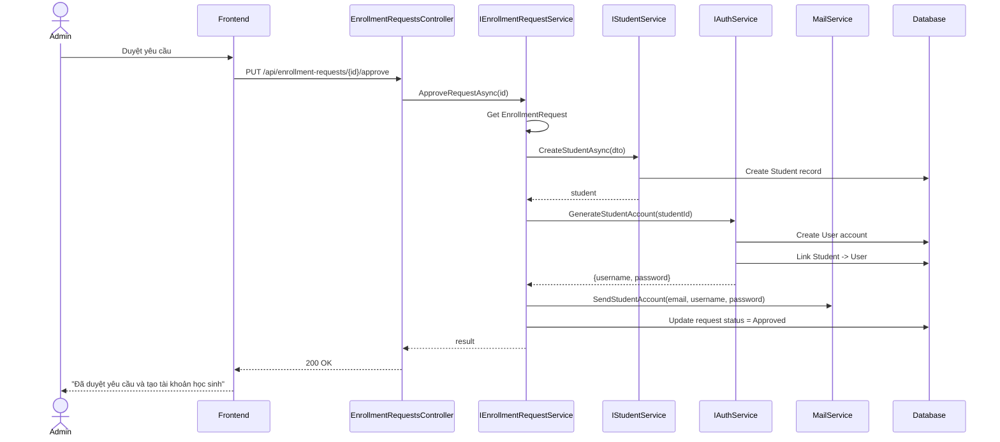
```mermaid
sequenceDiagram
    actor Admin
    participant Frontend
    participant EnrollController as EnrollmentRequestsController
    participant EnrollService as IEnrollmentRequestService
    participant StudentService as IStudentService
    participant AuthService as IAuthService
    participant MailService as MailService
    participant Database as Database

    Admin->>Frontend: Duyệt yêu cầu
    Frontend->>EnrollController: PUT /api/enrollment-requests/{id}/approve
    EnrollController->>EnrollService: ApproveRequestAsync(id)
    EnrollService->>EnrollService: Get EnrollmentRequest
    EnrollService->>StudentService: CreateStudentAsync(dto)
    StudentService->>Database: Create Student record
    StudentService-->>EnrollService: student
    EnrollService->>AuthService: GenerateStudentAccount(studentId)
    AuthService->>Database: Create User account
    AuthService->>Database: Link Student -> User
    AuthService-->>EnrollService: {username, password}
    EnrollService->>MailService: SendStudentAccount(email, username, password)
    EnrollService->>Database: Update request status = Approved
    EnrollService-->>EnrollController: result
    EnrollController-->>Frontend: 200 OK
    Frontend-->>Admin: "Đã duyệt yêu cầu và tạo tài khoản học sinh"
```

### 3.3 Admin từ chối yêu cầu

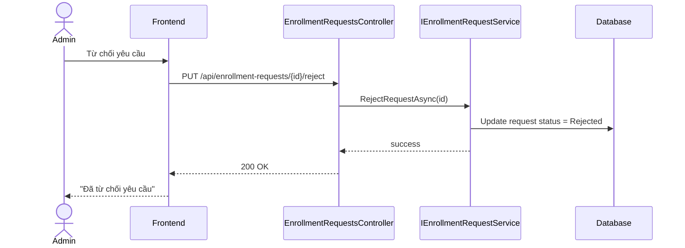
```mermaid
sequenceDiagram
    actor Admin
    participant Frontend
    participant EnrollController as EnrollmentRequestsController
    participant EnrollService as IEnrollmentRequestService
    participant Database as Database

    Admin->>Frontend: Từ chối yêu cầu
    Frontend->>EnrollController: PUT /api/enrollment-requests/{id}/reject
    EnrollController->>EnrollService: RejectRequestAsync(id)
    EnrollService->>Database: Update request status = Rejected
    EnrollService-->>EnrollController: success
    EnrollController-->>Frontend: 200 OK
    Frontend-->>Admin: "Đã từ chối yêu cầu"
```

### Class Diagram - 3.1 Tạo yêu cầu ghi danh

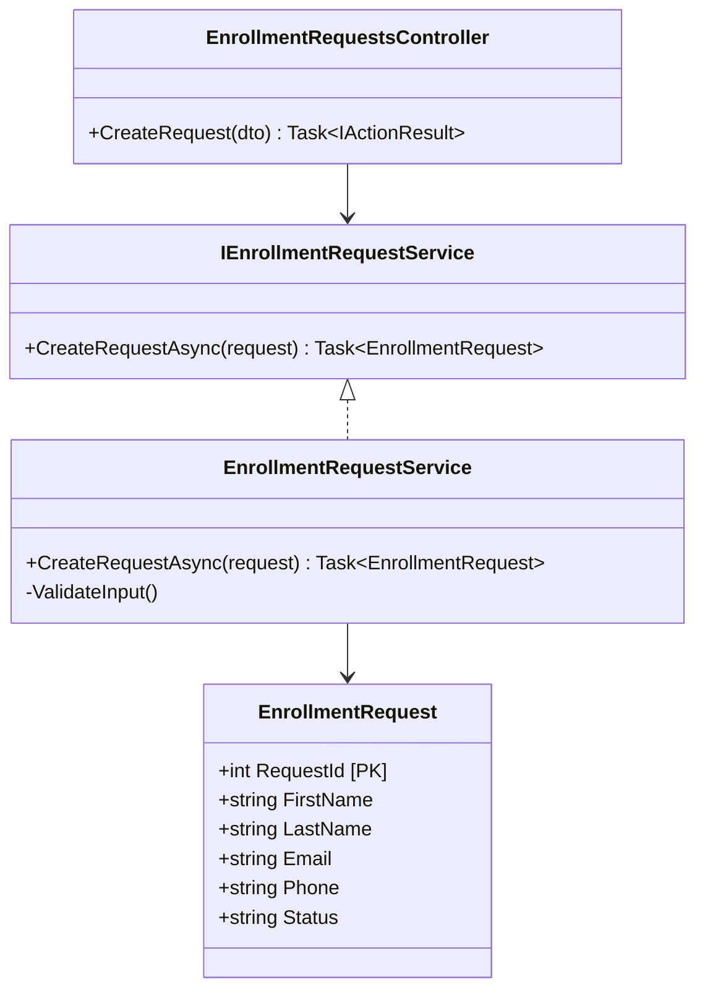
```mermaid
classDiagram
    class EnrollmentRequestsController {
        +CreateRequest(dto) Task~IActionResult~
    }

    class IEnrollmentRequestService {
        +CreateRequestAsync(request) Task~EnrollmentRequest~
    }

    class EnrollmentRequestService {
        +CreateRequestAsync(request) Task~EnrollmentRequest~
        -ValidateInput()
    }

    class EnrollmentRequest {
        +int RequestId [PK]
        +string FirstName
        +string LastName
        +string Email
        +string Phone
        +string Status
    }

    EnrollmentRequestsController --> IEnrollmentRequestService
    IEnrollmentRequestService <|.. EnrollmentRequestService
    EnrollmentRequestService --> EnrollmentRequest
```

### 3.2 Duyệt yêu cầu ghi danh

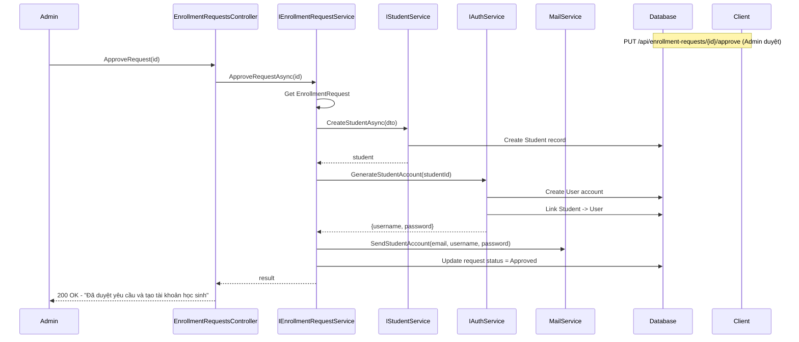
```mermaid
sequenceDiagram
    participant Admin as Admin
    participant EnrollController as EnrollmentRequestsController
    participant EnrollService as IEnrollmentRequestService
    participant StudentService as IStudentService
    participant AuthService as IAuthService
    participant MailService as MailService
    participant EducenV2Context as Database

    Note over Client, EducenV2Context: PUT /api/enrollment-requests/{id}/approve (Admin duyệt)
    Admin->>EnrollController: ApproveRequest(id)
    EnrollController->>EnrollService: ApproveRequestAsync(id)
    EnrollService->>EnrollService: Get EnrollmentRequest
    EnrollService->>StudentService: CreateStudentAsync(dto)
    StudentService->>EducenV2Context: Create Student record
    StudentService-->>EnrollService: student
    EnrollService->>AuthService: GenerateStudentAccount(studentId)
    AuthService->>EducenV2Context: Create User account
    AuthService->>EducenV2Context: Link Student -> User
    AuthService-->>EnrollService: {username, password}
    EnrollService->>MailService: SendStudentAccount(email, username, password)
    EnrollService->>EducenV2Context: Update request status = Approved
    EnrollService-->>EnrollController: result
    EnrollController-->>Admin: 200 OK - "Đã duyệt yêu cầu và tạo tài khoản học sinh"
```

### Class Diagram - 3.2 Duyệt yêu cầu

```mermaid
classDiagram
    class EnrollmentRequestsController {
        +ApproveRequest(id) Task~IActionResult~
    }

    class IEnrollmentRequestService {
        +ApproveRequestAsync(id) Task~bool~
    }

    class EnrollmentRequestService {
        +ApproveRequestAsync(id) Task~bool~
    }

    class IStudentService {
        +CreateStudentAsync(dto) Task~Student~
    }

    class StudentService {
        +CreateStudentAsync(dto) Task~Student~
    }

    class IAuthService {
        +GenerateStudentAccount(studentId) Task~AccountResult~
    }

    class AuthService {
        +GenerateStudentAccount(studentId) Task~AccountResult~
    }

    class MailService {
        +SendStudentAccountEmail() Task
    }

    class EnrollmentRequest {
        +int RequestId [PK]
        +string Status
    }

    class Student {
        +int UserId [PK, FK]
    }

    class User {
        +int UserId [PK]
        +string Username
    }

    EnrollmentRequestsController --> IEnrollmentRequestService
    IEnrollmentRequestService <|.. EnrollmentRequestService
    EnrollmentRequestService --> IStudentService
    IStudentService <|.. StudentService
    StudentService --> Student
    EnrollmentRequestService --> IAuthService
    IAuthService <|.. AuthService
    AuthService --> User
    EnrollmentRequestService --> MailService
    Student --* User : 1:1
```

### 3.3 Từ chối yêu cầu

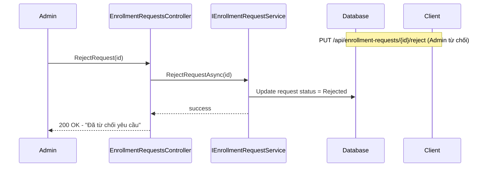
```mermaid
sequenceDiagram
    participant Admin as Admin
    participant EnrollController as EnrollmentRequestsController
    participant EnrollService as IEnrollmentRequestService
    participant EducenV2Context as Database

    Note over Client, EducenV2Context: PUT /api/enrollment-requests/{id}/reject (Admin từ chối)
    Admin->>EnrollController: RejectRequest(id)
    EnrollController->>EnrollService: RejectRequestAsync(id)
    EnrollService->>EducenV2Context: Update request status = Rejected
    EnrollService-->>EnrollController: success
    EnrollController-->>Admin: 200 OK - "Đã từ chối yêu cầu"
```

### Class Diagram - 3.3 Từ chối yêu cầu

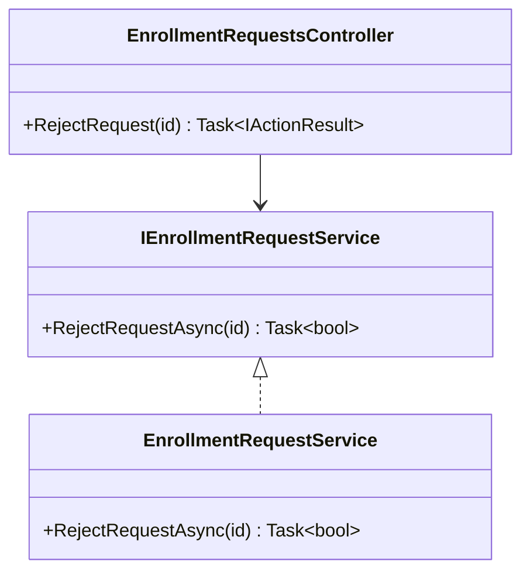
```mermaid
classDiagram
    class EnrollmentRequestsController {
        +RejectRequest(id) Task~IActionResult~
    }

    class IEnrollmentRequestService {
        +RejectRequestAsync(id) Task~bool~
    }

    class EnrollmentRequestService {
        +RejectRequestAsync(id) Task~bool~
    }

    EnrollmentRequestsController --> IEnrollmentRequestService
    IEnrollmentRequestService <|.. EnrollmentRequestService
```

### Class Diagram - Xử lý yêu cầu ghi danh

```mermaid
classDiagram
    class EnrollmentRequestsController {
        +CreateRequest(dto) Task~IActionResult~
        +ApproveRequest(id) Task~IActionResult~
        +RejectRequest(id) Task~IActionResult~
    }

    class IEnrollmentRequestService {
        +CreateRequestAsync(request) Task~EnrollmentRequest~
        +ApproveRequestAsync(id) Task~bool~
        +RejectRequestAsync(id) Task~bool~
    }

    class EnrollmentRequestService {
        +CreateRequestAsync(request) Task~EnrollmentRequest~
        +ApproveRequestAsync(id) Task~bool~
        +RejectRequestAsync(id) Task~bool~
    }

    class IStudentService {
        +CreateStudentAsync(dto) Task~Student~
    }

    class StudentService {
        +CreateStudentAsync(dto) Task~Student~
    }

    class IAuthService {
        +GenerateStudentAccount(studentId) Task~AccountResult~
    }

    class AuthService {
        +GenerateStudentAccount(studentId) Task~AccountResult~
    }

    class MailService {
        +SendStudentAccountEmail() Task
    }

    class EnrollmentRequest {
        +int RequestId [PK]
        +string FirstName
        +string LastName
        +string Email
        +string Phone
        +string Status
        +DateTime RequestDate
    }

    class Student {
        +int UserId [PK, FK]
        +string? Email
        +string? EnrollmentStatus
    }

    class User {
        +int UserId [PK]
        +string Username
        +string PasswordHash
    }

    EnrollmentRequestsController --> IEnrollmentRequestService
    IEnrollmentRequestService <|.. EnrollmentRequestService
    EnrollmentRequestService --> EnrollmentRequest
    EnrollmentRequestService --> IStudentService
    IStudentService <|.. StudentService
    StudentService --> Student
    EnrollmentRequestService --> IAuthService
    IAuthService <|.. AuthService
    AuthService --> User
    EnrollmentRequestService --> MailService
    EnrollmentRequest --> Student : creates
    Student --* User : 1:1
```

---

## 4. Thanh toán

### 4.1 Tạo thanh toán

```mermaid
sequenceDiagram
    actor User
    participant Frontend
    participant PaymentsController as PaymentsController
    participant IPaymentService as IPaymentService
    participant PaymentGateway as VNPay Gateway
    participant Database as Database

    User->>Frontend: Tạo yêu cầu thanh toán
    Frontend->>PaymentsController: POST /api/payments/create {amount, description}
    PaymentsController->>IPaymentService: CreatePaymentAsync(dto)
    IPaymentService->>IPaymentService: Validate input
    IPaymentService->>Database: Create Payment record (Pending)
    IPaymentService->>IPaymentService: Build payment URL
    IPaymentService->>PaymentGateway: CreatePayment(paymentInfo)
    PaymentGateway-->>IPaymentService: paymentUrl
    IPaymentService-->>PaymentsController: {paymentUrl, orderId}
    PaymentsController-->>Frontend: 200 OK {paymentUrl, orderId}
    Frontend-->>User: Chuyển đến trang thanh toán
    
    User->>PaymentGateway: Điền thông tin thanh toán
    PaymentGateway-->>User: Form thanh toán
    User->>PaymentGateway: Xác nhận thanh toán
```

### 4.2 VNPay Callback

```mermaid
sequenceDiagram
    actor VNPay
    participant Frontend
    participant PaymentsController as PaymentsController
    participant IPaymentService as IPaymentService
    participant Database as Database

    VNPay->>PaymentsController: POST /api/payments/vnpay/callback {vnp_*}
    PaymentsController->>PaymentsController: ExtractCallbackData()
    PaymentsController->>IPaymentService: ProcessCallbackAsync("VNPay", data)
    IPaymentService->>IPaymentService: Validate signature
    alt Invalid signature
        IPaymentService-->>PaymentsController: result.IsValid = false
        PaymentsController-->>VNPay: {RspCode: 97}
    end
    IPaymentService->>Database: Check duplicate transaction
    alt Already processed
        IPaymentService-->>PaymentsController: duplicate
        PaymentsController-->>VNPay: Success (safe)
    end
    IPaymentService->>Database: Update Payment status = Success
    IPaymentService->>IPaymentService: Handle post-payment logic
    IPaymentService-->>PaymentsController: result
    PaymentsController-->>VNPay: {RspCode: 00}
```

### Class Diagram - 4.1 Tạo thanh toán

```mermaid
classDiagram
    class PaymentsController {
        +CreatePayment(dto) Task~IActionResult~
    }

    class IPaymentService {
        +CreatePaymentAsync(dto) Task~PaymentUrlResult~
    }

    class PaymentService {
        +CreatePaymentAsync(dto) Task~PaymentUrlResult~
        -BuildPaymentUrl()
    }

    class PaymentRecord {
        +string PaymentId [PK]
        +string TenantId [FK]
        +decimal Amount
        +string Status
    }

    class VNPayGateway {
        +CreatePayment(paymentInfo) string
    }

    PaymentsController --> IPaymentService
    IPaymentService <|.. PaymentService
    PaymentService --> PaymentRecord
    PaymentService --> VNPayGateway
    PaymentRecord --> VNPayGateway : uses
```

### 4.2 VNPay Callback

```mermaid
sequenceDiagram
    participant Client as VNPay
    participant VNPay as VNPay Gateway
    participant PaymentsController as PaymentsController
    participant IPaymentService as IPaymentService
    participant EducenV2Context as Database

    Note over Client, EducenV2Context: POST /api/payments/vnpay/callback
    VNPay->>PaymentsController: Callback with vnp_* params
    PaymentsController->>PaymentsController: ExtractCallbackData()
    PaymentsController->>IPaymentService: ProcessCallbackAsync("VNPay", data)
    IPaymentService->>IPaymentService: Validate signature
    alt Invalid signature
        IPaymentService-->>PaymentsController: result.IsValid = false
        PaymentsController-->>VNPay: {RspCode: 97}
    end
    IPaymentService->>EducenV2Context: Check duplicate transaction
    alt Already processed
        IPaymentService-->>PaymentsController: duplicate
        PaymentsController-->>VNPay: Success (safe)
    end
    IPaymentService->>EducenV2Context: Update Payment status = Success
    IPaymentService->>IPaymentService: Handle post-payment logic (activate subscription)
    IPaymentService-->>PaymentsController: result
    PaymentsController-->>VNPay: {RspCode: 00} (IPN) or Redirect (Browser)
    
    Note over Client, EducenV2Context: POST /api/payments/confirm (Frontend confirm)
    Client->>PaymentsController: ConfirmPayment(vnpayParams)
    PaymentsController->>IPaymentService: ProcessCallbackAsync
    IPaymentService->>EducenV2Context: Process transaction
    IPaymentService-->>PaymentsController: {success, orderId}
    PaymentsController-->>Client: {success, orderId, status}
```

### Class Diagram - 4.2 VNPay Callback

```mermaid
classDiagram
    class PaymentsController {
        +ConfirmPayment(params) Task~IActionResult~
    }

    class IPaymentService {
        +ProcessCallbackAsync(gateway, data) Task~CallbackResult~
    }

    class PaymentService {
        +ProcessCallbackAsync(gateway, data) Task~CallbackResult~
        -ValidateSignature()
        -CheckDuplicateTransaction()
        -HandlePostPayment()
    }

    class PaymentRecord {
        +string PaymentId [PK]
        +string Status
    }

    class PaymentTransaction {
        +string TransactionId [PK]
        +string PaymentId [FK]
        +string Status
    }

    class Tenant {
        +string TenantId [PK]
        +bool IsActive
    }

    PaymentsController --> IPaymentService
    IPaymentService <|.. PaymentService
    PaymentService --> PaymentRecord
    PaymentService --> PaymentTransaction
    PaymentService --> Tenant
    PaymentRecord --* PaymentTransaction : creates
    PaymentRecord --> Tenant : belongs
```

### 4.3 Verify Payment

```mermaid
sequenceDiagram
    participant Client as Frontend
    participant PaymentsController as PaymentsController
    participant IPaymentService as IPaymentService
    participant EducenV2Context as Database

    Note over Client, EducenV2Context: GET /api/payments/verify/{paymentRecordId}
    Client->>PaymentsController: VerifyPayment(paymentRecordId)
    PaymentsController->>IPaymentService: GetTransactionsByPaymentIdAsync(paymentRecordId)
    IPaymentService->>EducenV2Context: Get Transactions
    EducenV2Context-->>IPaymentService: transactions
    IPaymentService-->>PaymentsController: transactions
    alt No transactions found
        PaymentsController-->>Client: 404 Not Found
    end
    PaymentsController-->>Client: 200 OK - {status, amount, createdAt}
```

### Class Diagram - 4.3 Verify Payment

```mermaid
classDiagram
    class PaymentsController {
        +VerifyPayment(id) Task~IActionResult~
    }

    class IPaymentService {
        +GetTransactionsByPaymentIdAsync(id) Task~IEnumerable~PaymentTransaction~~
    }

    class PaymentService {
        +GetTransactionsByPaymentIdAsync(id) Task~IEnumerable~PaymentTransaction~~
    }

    class PaymentTransaction {
        +string TransactionId [PK]
        +string PaymentId [FK]
        +decimal Amount
        +string Status
    }

    PaymentsController --> IPaymentService
    IPaymentService <|.. PaymentService
    PaymentService --> PaymentTransaction
```

---

## 5. Quản lý học sinh

### 5.1 Admin tạo học sinh mới

```mermaid
sequenceDiagram
    actor Admin
    participant Frontend
    participant StudentsController as StudentsController
    participant StudentService as IStudentService
    participant Database as Database

    Admin->>Frontend: Nhập thông tin học sinh
    Frontend->>StudentsController: POST /api/students {studentDto}
    StudentsController->>StudentService: CreateStudentAsync(dto)
    StudentService->>Database: Check existing (email, phone)
    alt Already exists
        StudentService-->>StudentsController: Exception
        StudentsController-->>Frontend: 409 Conflict
    end
    StudentService->>Database: Create Student record
    StudentService-->>StudentService: isAutoCreateAccount = true?
    alt Auto create account
        StudentService->>Database: Create User account
        StudentService->>Database: Link Student -> User
    end
    StudentService-->>StudentsController: student
    StudentsController-->>Frontend: 201 Created
    Frontend-->>Admin: "Tạo học sinh thành công"
```

### 5.2 Admin gửi tài khoản học sinh

```mermaid
sequenceDiagram
    actor Admin
    participant Frontend
    participant StudentsController as StudentsController
    participant MailService as MailService
    participant Database as Database

    Admin->>Frontend: Gửi tài khoản học sinh
    Frontend->>StudentsController: POST /api/students/send-account/{studentId}
    StudentsController->>Database: Find User
    Database-->>StudentsController: User
    alt User not found or no email
        StudentsController-->>Frontend: 400/404 Error
    end
    StudentsController->>StudentsController: GenerateSecurePassword()
    StudentsController->>Database: Update User (PasswordHash, IsAccountSent=true)
    StudentsController->>MailService: SendStudentAccount(email, username, password)
    MailService-->>Frontend: Email sent
    StudentsController-->>Frontend: 200 OK
    Frontend-->>Admin: "Đã gửi tài khoản thành công"
```

### 5.3 Admin thêm học sinh vào lớp

```mermaid
sequenceDiagram
    actor Admin
    participant Frontend
    participant ClassesController as ClassesController
    participant ClassService as IClassService
    participant Database as Database

    Admin->>Frontend: Thêm học sinh vào lớp
    Frontend->>ClassesController: POST /api/classes/{id}/students/{studentId}
    ClassesController->>ClassService: AddStudentToClassAsync(classId, studentId)
    ClassService->>Database: Find Class
    ClassService->>Database: Find Student
    alt Student already in class
        ClassService-->>ClassesController: Exception
    end
    ClassService->>Database: Add Student to ClassStudents
    ClassService-->>ClassesController: success
    ClassesController-->>Frontend: 200 OK
    Frontend-->>Admin: "Đã thêm học sinh vào lớp"
```

### Class Diagram - 5.1 Tạo học sinh mới

```mermaid
classDiagram
    class StudentsController {
        +CreateStudent(dto) Task~IActionResult~
    }

    class IStudentService {
        +CreateStudentAsync(dto) Task~Student~
    }

    class StudentService {
        +CreateStudentAsync(dto) Task~Student~
        -CheckExisting()
        -CreateUser()
    }

    class Student {
        +int UserId [PK, FK]
        +string? Email
        +string? EnrollmentStatus
    }

    class User {
        +int UserId [PK]
        +string Email
        +PasswordHash
    }

    StudentsController --> IStudentService
    IStudentService <|.. StudentService
    StudentService --> Student
    StudentService --> User
    Student --* User : 1:1
```

### 5.2 Gửi tài khoản học sinh

```mermaid
sequenceDiagram
    participant Admin as Admin
    participant StudentsController as StudentsController
    participant MailService as MailService
    participant PasswordGenerator as Password Generator
    participant EducenV2Context as Database

    Note over Admin, MailService: POST /api/students/send-account/{studentId}
    Admin->>StudentsController: SendAccount(studentId)
    StudentsController->>EducenV2Context: Find User
    EducenV2Context-->>StudentsController: User
    alt User not found or no email
        StudentsController-->>Admin: 400/404 Error
    end
    StudentsController->>PasswordGenerator: GenerateSecurePassword()
    PasswordGenerator-->>StudentsController: newPassword
    StudentsController->>StudentsController: Hash password (BCrypt)
    StudentsController->>EducenV2Context: Update User (PasswordHash, IsAccountSent=true)
    StudentsController->>MailService: SendStudentAccount(email, username, password)
    MailService-->>EducenV2Context: Email sent
    StudentsController-->>Admin: 200 OK - "Đã gửi tài khoản thành công"
```

### Class Diagram - 5.2 Gửi tài khoản

```mermaid
classDiagram
    class StudentsController {
        +SendAccount(studentId) Task~IActionResult~
    }

    class MailService {
        +SendStudentAccountEmail() Task
    }

    class User {
        +string Email
        +PasswordHash
    }

    class Student {
        +int UserId [PK]
    }

    StudentsController --> MailService
    StudentsController --> User
    User --> Student : links
```

### 5.3 Thêm học sinh vào lớp

```mermaid
sequenceDiagram
    participant Admin as Admin
    participant ClassesController as ClassesController
    participant ClassService as IClassService
    participant EducenV2Context as Database

    Note over Admin, EducenV2Context: POST /api/classes/{id}/students/{studentId}
    Admin->>ClassesController: AddStudentToClass(classId, studentId)
    ClassesController->>ClassService: AddStudentToClassAsync(classId, studentId)
    ClassService->>EducenV2Context: Find Class
    ClassService->>EducenV2Context: Find Student
    alt Student already in class
        ClassService-->>ClassesController: Exception
    end
    ClassService->>EducenV2Context: Add Student to ClassStudents
    ClassService-->>ClassesController: success
    ClassesController-->>Admin: 200 OK - "Đã thêm học sinh vào lớp thành công"
```

### Class Diagram - 5.3 Thêm học sinh vào lớp

```mermaid
classDiagram
    class ClassesController {
        +AddStudentToClass(classId, studentId) Task~IActionResult~
    }

    class IClassService {
        +AddStudentToClassAsync(classId, studentId) Task~bool~
    }

    class ClassService {
        +AddStudentToClassAsync(classId, studentId) Task~bool~
    }

    class Class {
        +int ClassId [PK]
    }

    class Student {
        +int UserId [PK]
    }

    ClassesController --> IClassService
    IClassService <|.. ClassService
    ClassService --> Class
    ClassService --> Student
    Class --> Student : enrolls
```

### 5.4 Import học sinh vào lớp

```mermaid
sequenceDiagram
    participant Admin as Admin
    participant ClassesController as ClassesController
    participant ClassService as IClassService
    participant ExcelReader as Excel Reader
    participant EducenV2Context as Database

    Note over Admin, EducenV2Context: POST /api/classes/{id}/import-students
    Admin->>ClassesController: ImportStudentsToClass(classId, file)
    ClassesController->>ClassesController: Validate file (.xlsx, .xls)
    ClassesController->>ExcelReader: Read Excel file
    ExcelReader-->>ClassesController: dataSet
    ClassesController->>ClassesController: Validate headers
    loop For each row in Excel
        ClassesController->>EducenV2Context: Find User by email
        EducenV2Context-->>ClassesController: User
        alt User not found
            ClassesController-->>ClassesController: Add to errors
        end
        ClassesController->>EducenV2Context: Find Student by UserId
        EducenV2Context-->>ClassesController: Student
        alt Student not found
            ClassesController-->>ClassesController: Add to errors
        end
        ClassesController->>ClassService: ImportStudentToClassAsync(classId, dto)
        ClassService->>EducenV2Context: Add Student to Class
    end
    ClassesController-->>Admin: 200 OK - {success, failed, errors}
```

### Class Diagram - 5.4 Import học sinh

```mermaid
classDiagram
    class ClassesController {
        +ImportStudentsToClass(classId, file) Task~IActionResult~
    }

    class IClassService {
        +ImportStudentToClassAsync(classId, dto) Task~bool~
    }

    class ClassService {
        +ImportStudentToClassAsync(classId, dto) Task~bool~
    }

    class Student {
        +int UserId [PK]
    }

    class Class {
        +int ClassId [PK]
    }

    ClassesController --> IClassService
    IClassService <|.. ClassService
    ClassService --> Student
    ClassService --> Class
    Student --> Class : enrolled
```

### 5.5 Gửi tài khoản (Admin tạo account)

```mermaid
sequenceDiagram
    participant Admin as Admin
    participant StudentsController as StudentsController
    participant MailService as MailService
    participant EducenV2Context as Database

    Note over Admin, MailService: POST /api/students/create-account/{studentId}
    Admin->>StudentsController: CreateAccountForStudent(studentId, request)
    StudentsController->>EducenV2Context: Find Student
    EducenV2Context-->>StudentsController: Student
    alt Student not found or already has account
        StudentsController-->>Admin: 400/404 Error
    end
    StudentsController->>EducenV2Context: Check duplicate username
    alt Username exists
        StudentsController-->>Admin: 409 Conflict
    end
    StudentsController->>EducenV2Context: Create User account
    StudentsController->>EducenV2Context: Link Student -> User
    StudentsController->>MailService: SendStudentAccount(email, username, password)
    MailService-->>StudentsController: Email sent
    StudentsController-->>Admin: 200 OK - "Tài khoản đã được tạo và gửi thành công"
```

### Class Diagram - 5.5 Tạo tài khoản

```mermaid
classDiagram
    class StudentsController {
        +CreateAccountForStudent(studentId, request) Task~IActionResult~
    }

    class IAuthService {
        +GenerateStudentAccount(studentId) Task~AccountResult~
    }

    class AuthService {
        +GenerateStudentAccount(studentId) Task~AccountResult~
    }

    class MailService {
        +SendStudentAccountEmail() Task
    }

    class Student {
        +int UserId [PK]
    }

    class User {
        +int UserId [PK]
        +string Username
    }

    StudentsController --> IAuthService
    IAuthService <|.. AuthService
    AuthService --> Student
    AuthService --> User
    StudentsController --> MailService
    Student --* User : 1:1
```

---

## 6. Điểm danh

### 6.1 Giáo viên điểm danhBulk

```mermaid
sequenceDiagram
    actor Teacher
    participant Frontend
    participant AttendanceController as AttendanceController
    participant AttendanceService as IAttendanceService
    participant Database as Database

    Teacher->>Frontend: Nhập danh sách điểm danh
    Frontend->>AttendanceController: POST /api/attendance/session/{sessionId}/bulk {records}
    AttendanceController->>AttendanceController: Check permission
    alt Not Teacher/Assistant
        AttendanceController-->>Frontend: 403 Forbidden
    end
    AttendanceController->>AttendanceService: BulkSaveAttendanceAsync(sessionId, records, userId)
    AttendanceService->>Database: Validate session exists
    AttendanceService->>Database: Upsert AttendanceRecords
    AttendanceService-->>AttendanceController: success
    AttendanceController-->>Frontend: 200 OK
    Frontend-->>Teacher: "Lưu điểm danh thành công"
```

### 6.2 Điểm danh nhanh

```mermaid
sequenceDiagram
    actor Teacher
    participant Frontend
    participant AttendanceController as AttendanceController
    participant AttendanceService as IAttendanceService

    Teacher->>Frontend: Chọn học sinh điểm danh
    Frontend->>AttendanceController: POST /api/attendance/session/{sessionId}/quick {studentIds}
    AttendanceController->>AttendanceController: Check permission
    AttendanceController->>AttendanceService: BulkSaveAttendanceAsync(sessionId, records (status=present), userId)
    AttendanceService-->>AttendanceController: success
    AttendanceController-->>Frontend: 200 OK
    Frontend-->>Teacher: "Điểm danh nhanh thành công"
```

### 6.3 Kiểm tra có thể điểm danh

```mermaid
sequenceDiagram
    actor Teacher
    participant Frontend
    participant AttendanceController as AttendanceController

    Teacher->>Frontend: Kiểm tra điểm danh
    Frontend->>AttendanceController: GET /api/attendance/session/{sessionId}/can-attend
    AttendanceController->>AttendanceController: Find session
    alt Session not found
        AttendanceController-->>Frontend: 404 Not Found
    end
    AttendanceController->>AttendanceController: Check date logic (UTC+7)
    alt Session in future
        AttendanceController-->>Frontend: {canAttend: false, message: "Buổi học chưa diễn ra"}
    end
    alt Session too old (>2 days)
        AttendanceController-->>Frontend: {canAttend: false, message: "Đã quá hạn điểm danh"}
    end
    AttendanceController-->>Frontend: {canAttend: true}
    Frontend-->>Teacher: "Có thể điểm danh"
```

### Class Diagram - 6.1 Bulk Save Attendance

```mermaid
classDiagram
    class AttendanceController {
        +BulkSaveAttendance(sessionId, records) Task~IActionResult~
    }

    class IAttendanceService {
        +BulkSaveAttendanceAsync(sessionId, records, userId) Task~bool~
    }

    class AttendanceService {
        +BulkSaveAttendanceAsync(sessionId, records, userId) Task~bool~
    }

    class Attendance {
        +int AttendanceId [PK]
        +int SessionId [FK]
        +int StudentId [FK]
        +string Status
    }

    class ClassSession {
        +int SessionId [PK]
    }

    AttendanceController --> IAttendanceService
    IAttendanceService <|.. AttendanceService
    AttendanceService --> Attendance
    Attendance --> ClassSession : belongs
```

### 6.2 Quick Attendance (Điểm danh nhanh)

```mermaid
sequenceDiagram
    participant Teacher as Teacher/Assistant
    participant AttendanceController as AttendanceController
    participant AttendanceService as IAttendanceService

    Note over Teacher, AttendanceService: POST /api/attendance/session/{sessionId}/quick
    Teacher->>AttendanceController: QuickAttendance(sessionId, studentIds)
    AttendanceController->>AttendanceController: Check permission
    AttendanceController->>AttendanceService: BulkSaveAttendanceAsync(sessionId, records (status=present), userId)
    AttendanceService-->>AttendanceController: success
    AttendanceController-->>Teacher: 200 OK - "Điểm danh nhanh thành công"
```

### Class Diagram - 6.2 Quick Attendance

```mermaid
classDiagram
    class AttendanceController {
        +QuickAttendance(sessionId, studentIds) Task~IActionResult~
    }

    class IAttendanceService {
        +BulkSaveAttendanceAsync(sessionId, records, userId) Task~bool~
    }

    class AttendanceService {
        +BulkSaveAttendanceAsync(sessionId, records, userId) Task~bool~
    }

    AttendanceController --> IAttendanceService
    IAttendanceService <|.. AttendanceService
```

### 6.3 Kiểm tra có thể điểm danh

```mermaid
sequenceDiagram
    participant Teacher as Teacher/Assistant
    participant AttendanceController as AttendanceController
    participant ClassSession as ClassSession

    Note over Teacher, ClassSession: GET /api/attendance/session/{sessionId}/can-attend
    Teacher->>AttendanceController: CanAttendSession(sessionId)
    AttendanceController->>ClassSession: Find session
    alt Session not found
        AttendanceController-->>Teacher: 404 Not Found
    end
    AttendanceController->>AttendanceController: Check date logic (UTC+7)
    alt Session in future
        AttendanceController-->>Teacher: {canAttend: false, message: "Buổi học chưa diễn ra"}
    end
    alt Session too old (>2 days)
        AttendanceController-->>Teacher: {canAttend: false, message: "Đã quá hạn điểm danh"}
    end
    alt Session today but not started
        AttendanceController-->>Teacher: {canAttend: false, message: "Buổi học chưa bắt đầu"}
    end
    AttendanceController-->>Teacher: {canAttend: true, message: "Có thể điểm danh"}
```

### Class Diagram - 6.3 Kiểm tra điểm danh

```mermaid
classDiagram
    class AttendanceController {
        +CanAttendSession(sessionId) Task~IActionResult~
    }

    class ClassSession {
        +int SessionId [PK]
        +DateTime SessionDate
        +DateTime StartTime
    }

    AttendanceController --> ClassSession
```

---

## 7. Hoàn tiền

### 7.1 Admin tạo yêu cầu hoàn tiền

```mermaid
sequenceDiagram
    actor Admin
    participant Frontend
    participant RefundsController as RefundsController
    participant RefundService as IRefundService
    participant Database as Database

    Admin->>Frontend: Tạo yêu cầu hoàn tiền
    Frontend->>RefundsController: POST /api/refunds {refund}
    RefundsController->>RefundService: CreateRefundRequestAsync(refund)
    RefundService->>RefundService: Validate payment exists
    RefundService->>RefundService: Check if eligible for refund
    RefundService->>RefundService: Calculate refund amount
    RefundService->>Database: Save RefundRequest (Pending)
    RefundService-->>RefundsController: refund
    RefundsController-->>Frontend: 200 OK
    Frontend-->>Admin: "Tạo yêu cầu hoàn tiền thành công"
```

### 7.2 Admin phê duyệt hoàn tiền

```mermaid
sequenceDiagram
    actor Admin
    participant Frontend
    participant RefundsController as RefundsController
    participant RefundService as IRefundService

    Admin->>Frontend: Phê duyệt hoàn tiền
    Frontend->>RefundsController: POST /api/refunds/{refundId}/approve {notes}
    RefundsController->>RefundService: ApproveRefundAsync(refundId, userId, notes)
    RefundService->>RefundService: Update status = Approved
    RefundService-->>RefundsController: refund
    RefundsController-->>Frontend: 200 OK
    Frontend-->>Admin: "Đã duyệt hoàn tiền"
```

### 7.3 Admin từ chối hoàn tiền

```mermaid
sequenceDiagram
    actor Admin
    participant Frontend
    participant RefundsController as RefundsController
    participant RefundService as IRefundService

    Admin->>Frontend: Từ chối hoàn tiền
    Frontend->>RefundsController: POST /api/refunds/{refundId}/reject {reason}
    RefundsController->>RefundService: RejectRefundAsync(refundId, reason, userId)
    RefundService->>RefundService: Update status = Rejected
    RefundService-->>RefundsController: refund
    RefundsController-->>Frontend: 200 OK
    Frontend-->>Admin: "Đã từ chối hoàn tiền"
```

### 7.4 Xử lý hoàn tiền

```mermaid
sequenceDiagram
    actor Admin
    participant Frontend
    participant RefundsController as RefundsController
    participant RefundService as IRefundService
    participant VNPay as VNPay Gateway

    Admin->>Frontend: Xử lý hoàn tiền
    Frontend->>RefundsController: POST /api/refunds/{refundId}/process
    RefundsController->>RefundService: ProcessRefundAsync(refundId)
    RefundService->>RefundService: Check status = Approved
    RefundService->>VNPay: Refund(payment)
    VNPay-->>RefundService: success
    RefundService->>RefundService: Update status = Completed
    RefundService-->>RefundsController: refund
    RefundsController-->>Frontend: 200 OK
    Frontend-->>Admin: "Hoàn tiền thành công"
```

### Class Diagram - 7.1 Tạo yêu cầu hoàn tiền

```mermaid
classDiagram
    class RefundsController {
        +CreateRefund(request) Task~IActionResult~
    }

    class IRefundService {
        +CreateRefundRequestAsync(refund) Task~RefundRequest~
    }

    class RefundService {
        +CreateRefundRequestAsync(refund) Task~RefundRequest~
        -ValidatePayment()
        -CalculateRefundAmount()
    }

    class RefundRequest {
        +string RefundId [PK]
        +string PaymentRecordId [FK]
        +decimal OriginalAmount
        +decimal RefundAmount
    }

    RefundsController --> IRefundService
    IRefundService <|.. RefundService
    RefundService --> RefundRequest
```

### 7.2 Phê duyệt hoàn tiền

```mermaid
sequenceDiagram
    participant Admin as Admin/SystemAdmin
    participant RefundsController as RefundsController
    participant RefundService as IRefundService

    Note over Admin, RefundsController: POST /api/refunds/{refundId}/approve (Phê duyệt)
    Admin->>RefundsController: ApproveRefund(refundId, notes)
    RefundsController->>RefundService: ApproveRefundAsync(refundId, userId, notes)
    RefundService->>RefundService: Update status = Approved
    RefundService-->>RefundsController: refund
    RefundsController-->>Admin: 200 OK
```

### Class Diagram - 7.2 Phê duyệt

```mermaid
classDiagram
    class RefundsController {
        +ApproveRefund(refundId, notes) Task~IActionResult~
    }

    class IRefundService {
        +ApproveRefundAsync(refundId, userId, notes) Task~bool~
    }

    class RefundService {
        +ApproveRefundAsync(refundId, userId, notes) Task~bool~
    }

    class RefundRequest {
        +string RefundId [PK]
        +string Status
    }

    RefundsController --> IRefundService
    IRefundService <|.. RefundService
    RefundService --> RefundRequest
```

### 7.3 Từ chối hoàn tiền

```mermaid
sequenceDiagram
    participant Admin as Admin/SystemAdmin
    participant RefundsController as RefundsController
    participant RefundService as IRefundService

    Note over Admin, RefundsController: POST /api/refunds/{refundId}/reject (Từ chối)
    Admin->>RefundsController: RejectRefund(refundId, reason)
    RefundsController->>RefundService: RejectRefundAsync(refundId, reason, userId)
    RefundService->>RefundService: Update status = Rejected
    RefundService-->>RefundsController: refund
    RefundsController-->>Admin: 200 OK
```

### Class Diagram - 7.3 Từ chối

```mermaid
classDiagram
    class RefundsController {
        +RejectRefund(refundId, reason) Task~IActionResult~
    }

    class IRefundService {
        +RejectRefundAsync(refundId, reason, userId) Task~bool~
    }

    class RefundService {
        +RejectRefundAsync(refundId, reason, userId) Task~bool~
    }

    RefundsController --> IRefundService
    IRefundService <|.. RefundService
```

### 7.4 Xử lý hoàn tiền

```mermaid
sequenceDiagram
    participant Admin as Admin/SystemAdmin
    participant RefundsController as RefundsController
    participant RefundService as IRefundService
    participant VNPay as VNPay Gateway

    Note over Admin, VNPay: POST /api/refunds/{refundId}/process (Xử lý hoàn tiền)
    Admin->>RefundsController: ProcessRefund(refundId)
    RefundsController->>RefundService: ProcessRefundAsync(refundId)
    RefundService->>RefundService: Check status = Approved
    RefundService->>VNPay: Refund(payment)
    VNPay-->>RefundService: success
    RefundService->>RefundService: Update status = Completed
    RefundService-->>RefundsController: refund
    RefundsController-->>Admin: 200 OK
```

### Class Diagram - 7.4 Xử lý hoàn tiền

```mermaid
classDiagram
    class RefundsController {
        +ProcessRefund(refundId) Task~IActionResult~
    }

    class IRefundService {
        +ProcessRefundAsync(refundId) Task~bool~
    }

    class RefundService {
        +ProcessRefundAsync(refundId) Task~bool~
    }

    class IPaymentService {
        +ProcessRefund(payment) Task~RefundResult~
    }

    class PaymentService {
        +ProcessRefund(payment) Task~RefundResult~
    }

    class RefundRequest {
        +string RefundId [PK]
        +string Status
    }

    class PaymentRecord {
        +string PaymentId [PK]
    }

    RefundsController --> IRefundService
    IRefundService <|.. RefundService
    RefundService --> IPaymentService
    IPaymentService <|.. PaymentService
    PaymentService --> PaymentRecord
    RefundRequest --> PaymentRecord : references
```

### Class Diagram - Hoàn tiền

```mermaid
classDiagram
    class RefundsController {
        +CreateRefund(request) Task~IActionResult~
        +ApproveRefund(refundId, notes) Task~IActionResult~
        +RejectRefund(refundId, reason) Task~IActionResult~
        +ProcessRefund(refundId) Task~IActionResult~
    }

    class IRefundService {
        +CreateRefundRequestAsync(refund) Task~RefundRequest~
        +ApproveRefundAsync(refundId, userId, notes) Task~bool~
        +RejectRefundAsync(refundId, reason, userId) Task~bool~
        +ProcessRefundAsync(refundId) Task~bool~
    }

    class RefundService {
        +CreateRefundRequestAsync(refund) Task~RefundRequest~
        +ApproveRefundAsync(refundId, userId, notes) Task~bool~
        +RejectRefundAsync(refundId, reason, userId) Task~bool~
        +ProcessRefundAsync(refundId) Task~bool~
        -ValidatePayment()
        -CalculateRefundAmount()
    }

    class IPaymentService {
        +ProcessRefund(payment) Task~RefundResult~
    }

    class PaymentService {
        +ProcessRefund(payment) Task~RefundResult~
    }

    class RefundRequest {
        +string RefundId [PK]
        +string PaymentRecordId [FK]
        +string TenantId
        +decimal OriginalAmount
        +decimal RefundAmount
        +string Status
        +DateTime CreatedAt
    }

    class PaymentRecord {
        +string PaymentId [PK]
        +string TenantId
        +decimal Amount
        +string Status
    }

    RefundsController --> IRefundService
    IRefundService <|.. RefundService
    RefundService --> RefundRequest
    RefundService --> IPaymentService
    IPaymentService <|.. PaymentService
    PaymentService --> PaymentRecord
    RefundRequest --> PaymentRecord : references
```

---

## 8. Thông báo

### 8.1 Admin gửi nhắc nhở thanh toán

```mermaid
sequenceDiagram
    actor Admin
    participant Frontend
    participant NotificationsController as NotificationsController
    participant NotificationService as IPaymentReminderService
    participant MailService as MailService

    Admin->>Frontend: Gửi nhắc nhở
    Frontend->>NotificationsController: POST /api/notifications/send-reminder/{invoiceId}
    NotificationsController->>NotificationService: SendReminderAsync(invoiceId)
    NotificationService->>NotificationService: Get Invoice
    NotificationService->>NotificationService: Get Student/Parent
    NotificationService->>MailService: Send reminder email
    NotificationService->>NotificationService: Create Notification record
    NotificationService-->>NotificationsController: success
    NotificationsController-->>Frontend: 200 OK
    Frontend-->>Admin: "Đã gửi nhắc nhở thành công"
```

### 8.2 Admin gửi nhắc nhở hàng loạt

```mermaid
sequenceDiagram
    actor Admin
    participant Frontend
    participant NotificationsController as NotificationsController
    participant NotificationService as IPaymentReminderService

    Admin->>Frontend: Gửi nhắc nhở hàng loạt
    Frontend->>NotificationsController: POST /api/notifications/send-batch-reminders?daysBefore=3
    NotificationsController->>NotificationService: SendBatchRemindersAsync(daysBefore)
    NotificationService->>NotificationService: Get overdue invoices
    loop For each invoice
        NotificationService->>NotificationService: Send reminder
    end
    NotificationService-->>NotificationsController: result
    NotificationsController-->>Frontend: 200 OK {count}
    Frontend-->>Admin: "{count} email đã gửi"
```

### 8.3 User đánh dấu đã đọc

```mermaid
sequenceDiagram
    actor User
    participant Frontend
    participant NotificationsController as NotificationsController
    participant NotificationService as IPaymentReminderService

    User->>Frontend: Xem thông báo
    Frontend->>NotificationsController: POST /api/notifications/{notificationId}/read
    NotificationsController->>NotificationService: MarkNotificationAsReadAsync(notificationId)
    NotificationService->>NotificationService: Update Notification (IsRead = true)
    NotificationService-->>NotificationsController: success
    alt Not found
        NotificationsController-->>Frontend: 404 Not Found
    end
    NotificationsController-->>Frontend: 200 OK
    Frontend-->>User: "Đánh dấu đã đọc"
```

### Class Diagram - 8.1 Gửi nhắc nhở

```mermaid
classDiagram
    class NotificationsController {
        +SendReminder(invoiceId) Task~IActionResult~
    }

    class IPaymentReminderService {
        +SendReminderAsync(invoiceId) Task~bool~
    }

    class PaymentReminderService {
        +SendReminderAsync(invoiceId) Task~bool~
    }

    class MailService {
        +SendEmailAsync() Task
    }

    class Notification {
        +int NotificationId [PK]
        +int UserId [FK]
    }

    NotificationsController --> IPaymentReminderService
    IPaymentReminderService <|.. PaymentReminderService
    PaymentReminderService --> MailService
    PaymentReminderService --> Notification
```

### 8.2 Gửi nhắc nhở hàng loạt

```mermaid
sequenceDiagram
    participant SystemAdmin as Admin
    participant NotificationsController as NotificationsController
    participant NotificationService as IPaymentReminderService

    Note over SystemAdmin, NotificationService: POST /api/notifications/send-batch-reminders?daysBefore=3
    SystemAdmin->>NotificationsController: SendBatchReminders(daysBefore)
    NotificationsController->>NotificationService: SendBatchRemindersAsync(daysBefore)
    NotificationService->>NotificationService: Get overdue invoices
    loop For each invoice
        NotificationService->>NotificationService: Send reminder
    end
    NotificationService-->>NotificationsController: result
    NotificationsController-->>SystemAdmin: 200 OK - {count}
```

### Class Diagram - 8.2 Gửi nhắc nhở hàng loạt

```mermaid
classDiagram
    class NotificationsController {
        +SendBatchReminders(daysBefore) Task~IActionResult~
    }

    class IPaymentReminderService {
        +SendBatchRemindersAsync(daysBefore) Task~int~
    }

    class PaymentReminderService {
        +SendBatchRemindersAsync(daysBefore) Task~int~
    }

    NotificationsController --> IPaymentReminderService
    IPaymentReminderService <|.. PaymentReminderService
```

### 8.3 Đánh dấu đã đọc

```mermaid
sequenceDiagram
    participant Client as User
    participant NotificationsController as NotificationsController
    participant NotificationService as IPaymentReminderService

    Note over Client, NotificationService: POST /api/notifications/{notificationId}/read
    Client->>NotificationsController: MarkAsRead(notificationId)
    NotificationsController->>NotificationService: MarkNotificationAsReadAsync(notificationId)
    NotificationService->>NotificationService: Update Notification (IsRead = true)
    NotificationService-->>NotificationsController: success
    alt Not found
        NotificationsController-->>Client: 404 Not Found
    end
    NotificationsController-->>Client: 200 OK - "Đã đánh dấu thông báo là đã đọc"
```

### Class Diagram - Thông báo

```mermaid
classDiagram
    class NotificationsController {
        +SendReminder(invoiceId) Task~IActionResult~
        +SendBatchReminders(daysBefore) Task~IActionResult~
        +MarkAsRead(notificationId) Task~IActionResult~
    }

    class IPaymentReminderService {
        +SendReminderAsync(invoiceId) Task~bool~
        +SendBatchRemindersAsync(daysBefore) Task~int~
        +MarkNotificationAsReadAsync(notificationId) Task~bool~
    }

    class PaymentReminderService {
        +SendReminderAsync(invoiceId) Task~bool~
        +SendBatchRemindersAsync(daysBefore) Task~int~
        +MarkNotificationAsReadAsync(notificationId) Task~bool~
    }

    class MailService {
        +SendEmailAsync() Task
    }

    class Notification {
        +int NotificationId [PK]
        +string TenantId
        +int UserId [FK]
        +string Title
        +string Message
        +string Type
        +bool IsRead
        +DateTime CreatedAt
    }

    class TuitionInvoice {
        +string InvoiceId [PK]
        +int StudentId [FK]
        +decimal TotalAmount
        +string Status
    }

    class Student {
        +int UserId [PK, FK]
        +string? Email
    }

    class User {
        +int UserId [PK]
        +string Username
        +string Email
    }

    NotificationsController --> IPaymentReminderService
    IPaymentReminderService <|.. PaymentReminderService
    PaymentReminderService --> Notification
    PaymentReminderService --> TuitionInvoice
    PaymentReminderService --> Student
    PaymentReminderService --> MailService
    Notification --> User : sent to
```

---

## 9. Quản lý lớp học

### 9.1 Admin tạo lớp

```mermaid
sequenceDiagram
    actor Admin
    participant Frontend
    participant ClassesController as ClassesController
    participant ClassService as IClassService
    participant Database as Database

    Admin->>Frontend: Nhập thông tin lớp học
    Frontend->>ClassesController: POST /api/classes {classDto}
    ClassesController->>ClassService: CreateClassAsync(dto)
    ClassService->>ClassService: Validate (name, subject, etc.)
    ClassService->>Database: Save Class
    ClassService-->>ClassesController: class
    ClassesController-->>Frontend: 201 Created
    Frontend-->>Admin: "Tạo lớp thành công"
```

### 9.2 Admin phân công giáo viên

```mermaid
sequenceDiagram
    actor Admin
    participant Frontend
    participant ClassesController as ClassesController
    participant ClassService as IClassService

    Admin->>Frontend: Phân công giáo viên
    Frontend->>ClassesController: PUT /api/classes/{id}/assign-teacher {teacherId}
    ClassesController->>ClassService: AssignTeacherAsync(classId, teacherId)
    ClassService->>ClassService: Update Class.TeacherId
    ClassService-->>ClassesController: success
    ClassesController-->>Frontend: 200 OK
    Frontend-->>Admin: "Phân công giáo viên thành công"
```

### 9.3 Admin phân công trợ giảng

```mermaid
sequenceDiagram
    actor Admin
    participant Frontend
    participant ClassesController as ClassesController
    participant ClassService as IClassService

    Admin->>Frontend: Phân công trợ giảng
    Frontend->>ClassesController: PUT /api/classes/{id}/assign-assistant {assistantId}
    ClassesController->>ClassService: AssignAssistantAsync(classId, assistantId)
    ClassService-->>ClassesController: success
    ClassesController-->>Frontend: 200 OK
    Frontend-->>Admin: "Phân công trợ giảng thành công"
```

### 9.4 Admin cập nhật đơn giá

```mermaid
sequenceDiagram
    actor Admin
    participant Frontend
    participant ClassesController as ClassesController
    participant ClassService as IClassService

    Admin->>Frontend: Cập nhật đơn giá
    Frontend->>ClassesController: PUT /api/classes/{id}/price {price}
    ClassesController->>ClassService: UpdateClassPriceAsync(classId, price)
    ClassService-->>ClassesController: success
    ClassesController-->>Frontend: 200 OK
    Frontend-->>Admin: "Cập nhật đơn giá thành công"
```

### Class Diagram - 9.1 Tạo lớp

```mermaid
classDiagram
    class ClassesController {
        +CreateClass(dto) Task~IActionResult~
    }

    class IClassService {
        +CreateClassAsync(dto) Task~Class~
    }

    class ClassService {
        +CreateClassAsync(dto) Task~Class~
    }

    class Class {
        +int ClassId [PK]
        +string? ClassName
    }

    ClassesController --> IClassService
    IClassService <|.. ClassService
    ClassService --> Class
```

### 9.2 Phân công giáo viên

```mermaid
sequenceDiagram
    participant Admin as Admin
    participant ClassesController as ClassesController
    participant ClassService as IClassService

    Note over Admin, ClassService: PUT /api/classes/{id}/assign-teacher (Phân công GV)
    Admin->>ClassesController: AssignTeacher(classId, teacherId)
    ClassesController->>ClassService: AssignTeacherAsync(classId, teacherId)
    ClassService->>ClassService: Update Class.TeacherId
    ClassService-->>ClassesController: success
    ClassesController-->>Admin: 200 OK
```

### Class Diagram - 9.2 Phân công GV

```mermaid
classDiagram
    class ClassesController {
        +AssignTeacher(classId, teacherId) Task~IActionResult~
    }

    class IClassService {
        +AssignTeacherAsync(classId, teacherId) Task~bool~
    }

    class ClassService {
        +AssignTeacherAsync(classId, teacherId) Task~bool~
    }

    class Class {
        +int ClassId [PK]
        +int? TeacherId [FK]
    }

    class Teacher {
        +int UserId [PK]
    }

    ClassesController --> IClassService
    IClassService <|.. ClassService
    ClassService --> Class
    Class --> Teacher : assigned
```

### 9.3 Phân công trợ giảng

```mermaid
sequenceDiagram
    participant Admin as Admin
    participant ClassesController as ClassesController
    participant ClassService as IClassService

    Note over Admin, ClassService: PUT /api/classes/{id}/assign-assistant (Phân công TG)
    Admin->>ClassesController: AssignAssistant(classId, assistantId)
    ClassesController->>ClassService: AssignAssistantAsync(classId, assistantId)
    ClassService-->>ClassesController: success
    ClassesController-->>Admin: 200 OK
```

### Class Diagram - 9.3 Phân công TG

```mermaid
classDiagram
    class ClassesController {
        +AssignAssistant(classId, assistantId) Task~IActionResult~
    }

    class IClassService {
        +AssignAssistantAsync(classId, assistantId) Task~bool~
    }

    class ClassService {
        +AssignAssistantAsync(classId, assistantId) Task~bool~
    }

    class Class {
        +int ClassId [PK]
        +int? AssistantId [FK]
    }

    class Assistant {
        +int UserId [PK]
    }

    ClassesController --> IClassService
    IClassService <|.. ClassService
    ClassService --> Class
    Class --> Assistant : assigned
```

### 9.4 Cập nhật đơn giá

```mermaid
sequenceDiagram
    participant Admin as Admin
    participant ClassesController as ClassesController
    participant ClassService as IClassService

    Note over Admin, ClassService: PUT /api/classes/{id}/price (Cập nhật đơn giá)
    Admin->>ClassesController: UpdateClassPrice(classId, price)
    ClassesController->>ClassService: UpdateClassPriceAsync(classId, price)
    ClassService-->>ClassesController: success
    ClassesController-->>Admin: 200 OK
```

### Class Diagram - 9.4 Cập nhật đơn giá

```mermaid
classDiagram
    class ClassesController {
        +UpdateClassPrice(classId, price) Task~IActionResult~
    }

    class IClassService {
        +UpdateClassPriceAsync(classId, price) Task~bool~
    }

    class ClassService {
        +UpdateClassPriceAsync(classId, price) Task~bool~
    }

    class Class {
        +int ClassId [PK]
        +decimal? PricePerSession
    }

    ClassesController --> IClassService
    IClassService <|.. ClassService
    ClassService --> Class
```

### 9.5 Xóa lớp

```mermaid
sequenceDiagram
    participant Admin as Admin
    participant ClassesController as ClassesController
    participant ClassService as IClassService

    Note over Admin, ClassService: DELETE /api/classes/{id} (Xóa lớp)
    Admin->>ClassesController: DeleteClass(classId)
    ClassesController->>ClassService: DeleteClassAsync(classId)
    ClassService-->>ClassesController: success
    ClassesController-->>Admin: 200 OK
```

### Class Diagram - 9.5 Xóa lớp

```mermaid
classDiagram
    class ClassesController {
        +DeleteClass(classId) Task~IActionResult~
    }

    class IClassService {
        +DeleteClassAsync(classId) Task~bool~
    }

    class ClassService {
        +DeleteClassAsync(classId) Task~bool~
    }

    ClassesController --> IClassService
    IClassService <|.. ClassService
```

### 9.6 Lấy danh sách buổi học

```mermaid
sequenceDiagram
    participant Admin as Admin
    participant ClassesController as ClassesController
    participant ClassService as IClassService

    Note over Admin, ClassService: GET /api/classes/{id}/sessions (Lấy danh sách buổi học)
    Admin->>ClassesController: GetSessions(classId)
    ClassesController->>ClassService: GetSessionsByClassIdAsync(classId)
    ClassService-->>ClassesController: sessions
    ClassesController-->>Admin: 200 OK
```

### Class Diagram - 9.6 Lấy sessions

```mermaid
classDiagram
    class ClassesController {
        +GetSessions(classId) Task~IActionResult~
    }

    class IClassService {
        +GetSessionsByClassIdAsync(classId) Task~IEnumerable~ClassSession~~
    }

    class ClassService {
        +GetSessionsByClassIdAsync(classId) Task~IEnumerable~ClassSession~~
    }

    class ClassSession {
        +int SessionId [PK]
        +int ClassId [FK]
    }

    class Class {
        +int ClassId [PK]
    }

    ClassesController --> IClassService
    IClassService <|.. ClassService
    ClassService --> ClassSession
    ClassSession --> Class : belongs
```

### 9.7 Xem lớp học của học sinh

```mermaid
sequenceDiagram
    participant Student as Student
    participant ClassesController as ClassesController
    participant ClassService as IClassService

    Note over Student, ClassService: GET /api/classes/student/my-classes
    Student->>ClassesController: GetMyClasses()
    ClassesController->>ClassesController: Get studentId from token
    ClassesController->>ClassService: GetStudentClassesAsync(studentId)
    ClassService->>ClassService: Get classes where student is enrolled
    ClassService-->>ClassesController: classes
    ClassesController-->>Student: 200 OK - {classes}
    
    Note over Student, ClassService: GET /api/classes/student/{id}/detail (Chi tiết lớp)
    Student->>ClassesController: GetStudentClassDetail(classId)
    ClassesController->>ClassService: GetStudentClassDetailAsync(studentId, classId, baseUrl)
    ClassService-->>ClassesController: detail
    ClassesController-->>Student: 200 OK
```

### Class Diagram - Quản lý lớp học

```mermaid
classDiagram
    class ClassesController {
        +CreateClass(dto) Task~IActionResult~
        +AssignTeacher(classId, teacherId) Task~IActionResult~
        +AssignAssistant(classId, assistantId) Task~IActionResult~
        +UpdateClassPrice(classId, price) Task~IActionResult~
        +DeleteClass(classId) Task~IActionResult~
        +GetSessions(classId) Task~IActionResult~
        +GetMyClasses() Task~IActionResult~
    }

    class IClassService {
        +CreateClassAsync(dto) Task~Class~
        +AssignTeacherAsync(classId, teacherId) Task~bool~
        +AddStudentToClassAsync(classId, studentId) Task~bool~
        +GetStudentClassesAsync(studentId) Task~IEnumerable~Class~~
        +GetStudentClassDetailAsync(studentId, classId, baseUrl) Task~ClassDetail~
    }

    class ClassService {
        +CreateClassAsync(dto) Task~Class~
        +AssignTeacherAsync(classId, teacherId) Task~bool~
        +AssignAssistantAsync(classId, assistantId) Task~bool~
        +UpdateClassPriceAsync(classId, price) Task~bool~
        +DeleteClassAsync(classId) Task~bool~
        +GetStudentClassesAsync(studentId) Task~IEnumerable~Class~~
        +GetStudentClassDetailAsync(studentId, classId, baseUrl) Task~ClassDetail~
    }

    class Class {
        +int ClassId [PK]
        +int? TeacherId [FK]
        +int? AssistantId [FK]
        +int SubjectId [FK]
        +int? GradeId [FK]
        +int? RoomId [FK]
        +string? ClassName
        +decimal? PricePerSession
        +string? Status
    }

    class Teacher {
        +int UserId [PK, FK]
        +string? Specialization
    }

    class Assistant {
        +int UserId [PK, FK]
    }

    class Subject {
        +int SubjectId [PK]
        +string? SubjectName
    }

    class Grade {
        +int GradeId [PK]
        +string? GradeName
    }

    class Room {
        +int RoomId [PK]
        +string? RoomName
    }

    class Schedule {
        +int ScheduleId [PK]
        +int ClassId [FK]
    }

    class ClassSession {
        +int SessionId [PK]
        +int ScheduleId [FK]
    }

    class Student {
        +int UserId [PK, FK]
    }

    ClassesController --> IClassService
    IClassService <|.. ClassService
    ClassService --> Class
    Class --> Teacher : assigned to
    Class --> Assistant : assigned to
    Class --> Subject : belongs
    Class --> Grade : for
    Class --> Room : in
    Class --* Schedule : has
    ClassSession --> Schedule : belongs
```

---

## 10. Quản lý đăng ký gói

### 10.1 SystemAdmin đăng ký gói

```mermaid
sequenceDiagram
    actor SystemAdmin
    participant Frontend
    participant SubController as SubscriptionController
    participant SubService as ISubscriptionService
    participant Database as AdminDB

    SystemAdmin->>Frontend: Đăng ký gói dịch vụ
    Frontend->>SubController: POST /api/admin/tenants/subscribe {request}
    SubController->>SubService: RegisterSubscription(request)
    SubService->>SubService: Validate tenant
    SubService->>SubService: Calculate price
    SubService->>Database: Create Subscription
    SubService->>Database: Save Subscription months
    SubService-->>SubController: result
    SubController-->>Frontend: 200 OK
    Frontend-->>SystemAdmin: "Đăng ký gói thành công"
```

### 10.2 SystemAdmin hủy gói

```mermaid
sequenceDiagram
    actor SystemAdmin
    participant Frontend
    participant SubController as SubscriptionController
    participant SubService as ISubscriptionService

    SystemAdmin->>Frontend: Hủy gói dịch vụ
    Frontend->>SubController: POST /api/admin/tenants/{tenantId}/cancel
    SubController->>SubService: CancelSubscription(tenantId)
    SubService-->>SubController: result
    SubController-->>Frontend: 200 OK
    Frontend-->>SystemAdmin: "Hủy gói thành công"
```

### 10.3 SystemAdmin gia hạn gói

```mermaid
sequenceDiagram
    actor SystemAdmin
    participant Frontend
    participant SubController as SubscriptionController
    participant SubService as ISubscriptionService

    SystemAdmin->>Frontend: Gia hạn gói
    Frontend->>SubController: POST /api/admin/tenants/renew {request}
    SubController->>SubService: RenewSubscription(request)
    SubService->>SubService: Find current subscription
    SubService->>SubService: Extend months
    SubService->>SubService: Save
    SubService-->>SubController: result
    SubController-->>Frontend: 200 OK
    Frontend-->>SystemAdmin: "Gia hạn thành công"
```

### Class Diagram - 10.1 Đăng ký gói

```mermaid
classDiagram
    class SubscriptionController {
        +RegisterSubscription(request) Task~IActionResult~
    }

    class ISubscriptionService {
        +RegisterSubscription(request) Task~SubscriptionResult~
    }

    class SubscriptionService {
        +RegisterSubscription(request) Task~SubscriptionResult~
    }

    class Tenant {
        +string TenantId [PK]
    }

    class Subscription {
        +string Id [PK]
    }

    class Plan {
        +string PlanId [PK]
    }

    SubscriptionController --> ISubscriptionService
    ISubscriptionService <|.. SubscriptionService
    SubscriptionService --> Tenant
    SubscriptionService --> Subscription
    Subscription --> Plan
```

### 10.2 Hủy gói

```mermaid
sequenceDiagram
    participant SystemAdmin as SystemAdmin
    participant SubController as SubscriptionController
    participant SubService as ISubscriptionService

    Note over SystemAdmin, SubController: POST /api/admin/tenants/{tenantId}/cancel
    SystemAdmin->>SubController: CancelSubscription(tenantId)
    SubController->>SubService: CancelSubscription(tenantId)
    SubService->>SubService: Find active subscription
    SubService-->>SubController: result
    SubController-->>SystemAdmin: 200 OK
```

### Class Diagram - 10.2 Hủy gói

```mermaid
classDiagram
    class SubscriptionController {
        +CancelSubscription(tenantId) Task~IActionResult~
    }

    class ISubscriptionService {
        +CancelSubscription(tenantId) Task~bool~
    }

    class SubscriptionService {
        +CancelSubscription(tenantId) Task~bool~
    }

    SubscriptionController --> ISubscriptionService
    ISubscriptionService <|.. SubscriptionService
```

### 10.3 Gia hạn gói

```mermaid
sequenceDiagram
    participant SystemAdmin as SystemAdmin
    participant SubController as SubscriptionController
    participant SubService as ISubscriptionService

    Note over SystemAdmin, SubController: POST /api/admin/tenants/renew
    SystemAdmin->>SubController: RenewSubscription(request)
    SubController->>SubService: RenewSubscription(request)
    SubService->>SubService: Find current subscription
    SubService->>SubService: Extend months
    SubService->>SubService: Save
    SubService-->>SubController: result
    SubController-->>SystemAdmin: 200 OK
```

### Class Diagram - 10.3 Gia hạn

```mermaid
classDiagram
    class SubscriptionController {
        +RenewSubscription(request) Task~IActionResult~
    }

    class ISubscriptionService {
        +RenewSubscription(request) Task~SubscriptionResult~
    }

    class SubscriptionService {
        +RenewSubscription(request) Task~SubscriptionResult~
    }

    SubscriptionController --> ISubscriptionService
    ISubscriptionService <|.. SubscriptionService
```

```mermaid
sequenceDiagram
    participant SystemAdmin as SystemAdmin
    participant SubController as SubscriptionController
    participant SubService as ISubscriptionService
    participant AdminDbContext as AdminDB

    Note over SystemAdmin, AdminDB: POST /api/admin/tenants/subscribe
    SystemAdmin->>SubController: RegisterSubscription(request)
    SubController->>SubService: RegisterSubscription(request)
    SubService->>SubService: Validate tenant
    SubService->>SubService: Calculate price
    SubService->>AdminDbContext: Create Subscription
    SubService->>AdminDbContext: Save months
    SubService-->>SubController: result
    SubController-->>SystemAdmin: 200 OK

    Note over SystemAdmin, AdminDB: POST /api/admin/tenants/{tenantId}/cancel
    SystemAdmin->>SubController: CancelSubscription(tenantId)
    SubController->>SubService: CancelSubscription(tenantId)
    SubService->>AdminDbContext: Find active subscription
    alt No active subscription
        SubService-->>SubController: false
        SubController-->>SystemAdmin: 404
    end
    SubService->>AdminDbContext: Update subscription = Cancelled
    SubService-->>SubController: true
    SubController-->>SystemAdmin: 200 OK

    Note over SystemAdmin, AdminDB: POST /api/admin/tenants/renew
    SystemAdmin->>SubController: RenewSubscription(request)
    SubController->>SubService: RenewSubscription(request)
    SubService->>SubService: Find current subscription
    SubService->>SubService: Extend months
    SubService->>AdminDbContext: Save
    SubService-->>SubController: result
    SubController-->>SystemAdmin: 200 OK

    Note over SystemAdmin, AdminDB: POST /api/admin/tenants/change-plan
    SystemAdmin->>SubController: ChangePlan(request)
    SubController->>SubService: ChangePlan(request)
    SubService->>AdminDbContext: Update subscription plan
    SubService-->>SubController: result
    SubController-->>SystemAdmin: 200 OK

    Note over SystemAdmin, AdminDB: GET /api/admin/tenants/{tenantId}/subscription-history
    SystemAdmin->>SubController: GetSubscriptionHistory(tenantId)
    SubController->>SubController: Query PaymentRecords
    SubController-->>SystemAdmin: 200 OK - {payments}
```

### Class Diagram - Quản lý đăng ký gói

```mermaid
classDiagram
    class SubscriptionController {
        +RegisterSubscription(request) Task~IActionResult~
        +CancelSubscription(tenantId) Task~IActionResult~
        +RenewSubscription(request) Task~IActionResult~
        +ChangePlan(request) Task~IActionResult~
        +GetSubscriptionHistory(tenantId) Task~IActionResult~
    }

    class ISubscriptionService {
        +RegisterSubscription(request) Task~SubscriptionResult~
        +CancelSubscription(tenantId) Task~bool~
        +RenewSubscription(request) Task~SubscriptionResult~
        +ChangePlan(request) Task~bool~
    }

    class SubscriptionService {
        +RegisterSubscription(request) Task~SubscriptionResult~
        +CancelSubscription(tenantId) Task~bool~
        +RenewSubscription(request) Task~SubscriptionResult~
        +ChangePlan(request) Task~bool~
        -ValidateTenant()
        -CalculatePrice()
    }

    class Tenant {
        +string TenantId [PK]
        +string TenantName
        +string SubDomain
        +bool IsActive
        +decimal CreditBalance
    }

    class Subscription {
        +string Id [PK]
        +string TenantId [FK]
        +string PlanId [FK]
        +DateTime StartDate
        +DateTime EndDate
        +string Status
    }

    class Plan {
        +string PlanId [PK]
        +string PlanName
        +decimal PricePerMonth
        +int? MaxStudents
    }

    class TenantCreditLedger {
        +int Id [PK]
        +string TenantId [FK]
        +decimal Amount
        +string Type
    }

    class TenantRegistrationService {
        +CreateTenant(tenantInfo) Task~Tenant~
    }

    class ITenantService {
        +CreateTenant(info) Task~Tenant~
    }

    class TenantService {
        +CreateTenant(info) Task~Tenant~
    }

    SubscriptionController --> ISubscriptionService
    ISubscriptionService <|.. SubscriptionService
    SubscriptionService --> Tenant
    SubscriptionService --> Subscription
    SubscriptionService --> Plan
    SubscriptionService --> TenantCreditLedger
    Tenant --* Subscription : has
    Subscription --* Plan : belongs
    Tenant --* TenantCreditLedger : transactions
```

---

## 11. Quản lý học phí & Hóa đơn

### 11.1 Admin tính học phí

```mermaid
sequenceDiagram
    actor Admin
    participant Frontend
    participant TuitionController as TuitionController
    participant TuitionService as ITuitionService
    participant Database as Database

    Admin->>Frontend: Tính học phí
    Frontend->>TuitionController: POST /api/tuition/calculate {studentId, classId, month, year}
    TuitionController->>TuitionService: CalculateTuitionAsync(studentId, classId, month, year)
    TuitionService->>TuitionService: Get Class price
    TuitionService->>TuitionService: Apply discounts
    TuitionService-->>TuitionController: result
    TuitionController-->>Frontend: 200 OK {amount, details}
    Frontend-->>Admin: "Tổng học phí: {amount}"
```

### 11.2 Admin tạo hóa đơn

```mermaid
sequenceDiagram
    actor Admin
    participant Frontend
    participant TuitionController as TuitionController
    participant InvoiceService as IInvoiceService

    Admin->>Frontend: Tạo hóa đơn
    Frontend->>TuitionController: POST /api/tuition/invoices {request}
    TuitionController->>InvoiceService: CreateInvoiceAsync(request)
    InvoiceService->>InvoiceService: Calculate tuition
    InvoiceService->>InvoiceService: Apply discount
    InvoiceService->>Database: Save Invoice (Draft)
    InvoiceService-->>TuitionController: invoice
    TuitionController-->>Frontend: 201 Created
    Frontend-->>Admin: "Tạo hóa đơn thành công"
```

### 11.3 Admin gửi hóa đơn

```mermaid
sequenceDiagram
    actor Admin
    participant Frontend
    participant TuitionController as TuitionController
    participant InvoiceService as IInvoiceService
    participant MailService as MailService

    Admin->>Frontend: Gửi hóa đơn
    Frontend->>TuitionController: POST /api/tuition/invoices/{id}/send
    TuitionController->>InvoiceService: SendInvoiceAsync(invoiceId)
    InvoiceService->>InvoiceService: Get Invoice
    InvoiceService->>InvoiceService: Generate PDF
    InvoiceService->>MailService: Send email
    InvoiceService-->>TuitionController: success
    TuitionController-->>Frontend: 200 OK
    Frontend-->>Admin: "Gửi hóa đơn thành công"
```

```mermaid
sequenceDiagram
    participant Admin as Admin
    participant TuitionController as TuitionController
    participant TuitionService as ITuitionService

    Note over Admin, TuitionService: POST /api/tuition/calculate
    Admin->>TuitionController: CalculateTuition(request)
    TuitionController->>TuitionService: CalculateTuitionAsync(studentId, classId, month, year)
    TuitionService->>TuitionService: Get Class price
    TuitionService->>TuitionService: Apply discounts
    TuitionService-->>TuitionController: result
    TuitionController-->>Admin: 200 OK - {amount, details}
```

### Class Diagram - 11.1 Tính học phí

```mermaid
classDiagram
    class TuitionController {
        +CalculateTuition(request) Task~IActionResult~
    }

    class ITuitionService {
        +CalculateTuitionAsync(studentId, classId, month, year) Task~TuitionResult~
    }

    class TuitionService {
        +CalculateTuitionAsync(studentId, classId, month, year) Task~TuitionResult~
    }

    class Class {
        +int ClassId [PK]
        +decimal? PricePerSession
    }

    class Student {
        +int UserId [PK]
    }

    TuitionController --> ITuitionService
    ITuitionService <|.. TuitionService
    TuitionService --> Class
    TuitionService --> Student
```

### 11.2 Tạo hóa đơn

```mermaid
sequenceDiagram
    participant Admin as Admin
    participant TuitionController as TuitionController
    participant InvoiceService as IInvoiceService

    Note over Admin, InvoiceService: POST /api/tuition/invoices (Đơn)
    Admin->>TuitionController: CreateInvoice(request)
    TuitionController->>InvoiceService: CreateInvoiceAsync(request)
    InvoiceService->>InvoiceService: Calculate tuition
    InvoiceService->>InvoiceService: Apply discount
    InvoiceService->>EducenV2Context: Save Invoice (Draft)
    InvoiceService-->>TuitionController: invoice
    TuitionController-->>Admin: 201 Created
```

### Class Diagram - 11.2 Tạo hóa đơn

```mermaid
classDiagram
    class TuitionController {
        +CreateInvoice(request) Task~IActionResult~
    }

    class IInvoiceService {
        +CreateInvoiceAsync(request) Task~TuitionInvoice~
    }

    class InvoiceService {
        +CreateInvoiceAsync(request) Task~TuitionInvoice~
    }

    class TuitionInvoice {
        +string InvoiceId [PK]
        +int StudentId [FK]
        +decimal TotalAmount
    }

    TuitionController --> IInvoiceService
    IInvoiceService <|.. InvoiceService
    InvoiceService --> TuitionInvoice
```

### 11.3 Gửi hóa đơn

```mermaid
sequenceDiagram
    participant Admin as Admin
    participant TuitionController as TuitionController
    participant InvoiceService as IInvoiceService

    Note over Admin, TuitionController: POST /api/tuition/invoices/{id}/send
    Admin->>TuitionController: SendInvoice(invoiceId)
    TuitionController->>InvoiceService: SendInvoiceAsync(invoiceId)
    InvoiceService->>InvoiceService: Generate PDF
    InvoiceService->>MailService: Send email
    InvoiceService-->>TuitionController: success
    TuitionController-->>Admin: 200 OK
```

### Class Diagram - 11.3 Gửi hóa đơn

```mermaid
classDiagram
    class TuitionController {
        +SendInvoice(invoiceId) Task~IActionResult~
    }

    class IInvoiceService {
        +SendInvoiceAsync(invoiceId) Task~bool~
    }

    class InvoiceService {
        +SendInvoiceAsync(invoiceId) Task~bool~
    }

    class MailService {
        +SendEmailAsync() Task
    }

    TuitionController --> IInvoiceService
    IInvoiceService <|.. InvoiceService
    InvoiceService --> MailService
```

```mermaid
sequenceDiagram
    participant Admin as Admin
    participant TuitionController as TuitionController
    participant TuitionService as ITuitionService
    participant InvoiceService as IInvoiceService
    participant EducenV2Context as Database

    Note over Admin, EducenV2Context: POST /api/tuition/calculate
    Admin->>TuitionController: CalculateTuition(request)
    TuitionController->>TuitionService: CalculateTuitionAsync(studentId, classId, month, year)
    TuitionService->>TuitionService: Get Class price
    TuitionService->>TuitionService: Apply discounts
    TuitionService-->>TuitionController: result
    TuitionController-->>Admin: 200 OK - {amount, details}

    Note over Admin, EducenV2Context: POST /api/tuition/calculate-class
    Admin->>TuitionController: CalculateClassTuition(request)
    TuitionController->>TuitionService: CalculateClassTuitionAsync(classId, month, year)
    TuitionService->>EducenV2Context: Get all students in class
    loop For each student
        TuitionService->>TuitionService: Calculate tuition
    end
    TuitionService-->>TuitionController: results
    TuitionController-->>Admin: 200 OK - {students[]}
```

### 11.2 Tạo hóa đơn

```mermaid
sequenceDiagram
    participant Admin as Admin
    participant TuitionController as TuitionController
    participant InvoiceService as IInvoiceService

    Note over Admin, InvoiceService: POST /api/tuition/invoices (Đơn)
    Admin->>TuitionController: CreateInvoice(request)
    TuitionController->>InvoiceService: CreateInvoiceAsync(request)
    InvoiceService->>InvoiceService: Calculate tuition
    InvoiceService->>InvoiceService: Apply discount
    InvoiceService->>EducenV2Context: Save Invoice (Draft)
    InvoiceService-->>TuitionController: invoice
    TuitionController-->>Admin: 201 Created

    Note over Admin, InvoiceService: POST /api/tuition/invoices/batch (Hàng loạt)
    Admin->>TuitionController: CreateBatchInvoices(request)
    TuitionController->>InvoiceService: CreateBatchInvoicesAsync(request)
    InvoiceService->>EducenV2Context: Get students in class
    loop For each student
        InvoiceService->>InvoiceService: Calculate & Create Invoice
    end
    InvoiceService-->>TuitionController: result
    TuitionController-->>Admin: 200 OK
```

### 11.3 Gửi & Thanh toán hóa đơn

```mermaid
sequenceDiagram
    participant Admin as Admin
    participant Student as Student/Parent
    participant TuitionController as TuitionController
    participant InvoiceService as IInvoiceService

    Note over Admin, EducenV2Context: POST /api/tuition/invoices/{id}/send
    Admin->>TuitionController: SendInvoice(invoiceId)
    TuitionController->>InvoiceService: SendInvoiceAsync(invoiceId)
    InvoiceService->>InvoiceService: Get Invoice
    InvoiceService->>InvoiceService: Generate PDF
    InvoiceService->>MailService: Send email
    InvoiceService->>EducenV2Context: Update status = Sent
    InvoiceService-->>TuitionController: success
    TuitionController-->>Admin: 200 OK

    Note over Student, EducenV2Context: GET /api/tuition/outstanding
    Student->>TuitionController: GetOutstandingInvoices()
    TuitionController->>TuitionService: GetOutstandingInvoicesAsync(studentId)
    TuitionService-->>TuitionController: invoices
    TuitionController-->>Student: 200 OK

    Note over Student, EducenV2Context: POST /api/tuition/invoices/{id}/mark-as-paid
    Admin->>TuitionController: MarkInvoiceAsPaid(invoiceId, method)
    TuitionController->>InvoiceService: MarkInvoiceAsPaidAsync(invoiceId, method)
    InvoiceService->>EducenV2Context: Update status = Paid
    InvoiceService-->>TuitionController: success
    TuitionController-->>Admin: 200 OK
```

### 11.4 Hóa đơn gia đình

```mermaid
sequenceDiagram
    participant Parent as Parent
    participant FamilyInvoiceController as FamilyInvoiceController
    participant InvoiceService as IInvoiceService
    participant TuitionService as ITuitionService

    Note over Parent, TuitionService: POST /api/family-invoices/create-family
    Parent->>FamilyInvoiceController: CreateFamilyInvoice(request)
    FamilyInvoiceController->>InvoiceService: CreateFamilyInvoiceAsync(parentId, request)
    InvoiceService->>TuitionService: Get outstanding invoices
    InvoiceService->>InvoiceService: Calculate total
    InvoiceService->>EducenV2Context: Save Family Invoice
    InvoiceService-->>FamilyInvoiceController: result
    FamilyInvoiceController-->>Parent: 200 OK

    Note over Parent, TuitionService: POST /api/family-invoices/pay-family/{id}
    Parent->>FamilyInvoiceController: PayFamilyInvoice(invoiceId, method)
    FamilyInvoiceController->>InvoiceService: PayFamilyInvoiceAsync(parentId, invoiceId, method)
    InvoiceService->>EducenV2Context: Update status = Paid
    InvoiceService->>EducenV2Context: Update child invoices
    InvoiceService-->>FamilyInvoiceController: success
    FamilyInvoiceController-->>Parent: 200 OK
```

### Class Diagram - Quản lý học phí & Hóa đơn

```mermaid
classDiagram
    class TuitionController {
        +CalculateTuition(request) Task~IActionResult~
        +CalculateClassTuition(request) Task~IActionResult~
        +CreateInvoice(request) Task~IActionResult~
        +CreateBatchInvoices(request) Task~IActionResult~
        +SendInvoice(invoiceId) Task~IActionResult~
        +GetOutstandingInvoices() Task~IActionResult~
        +MarkInvoiceAsPaid(invoiceId, method) Task~IActionResult~
    }

    class ITuitionService {
        +CalculateTuitionAsync(studentId, classId, month, year) Task~TuitionResult~
        +CalculateClassTuitionAsync(classId, month, year) Task~IEnumerable~TuitionResult~~
        +GetOutstandingInvoicesAsync(studentId) Task~IEnumerable~TuitionInvoice~~
    }

    class TuitionService {
        +CalculateTuitionAsync(studentId, classId, month, year) Task~TuitionResult~
        +CalculateClassTuitionAsync(classId, month, year) Task~IEnumerable~TuitionResult~~
        +GetOutstandingInvoicesAsync(studentId) Task~IEnumerable~TuitionInvoice~~
    }

    class IInvoiceService {
        +CreateInvoiceAsync(request) Task~TuitionInvoice~
        +CreateBatchInvoicesAsync(request) Task~BatchResult~
        +SendInvoiceAsync(invoiceId) Task~bool~
        +MarkInvoiceAsPaidAsync(invoiceId, method) Task~bool~
        +CreateFamilyInvoiceAsync(parentId, request) Task~FamilyInvoice~
    }

    class InvoiceService {
        +CreateInvoiceAsync(request) Task~TuitionInvoice~
        +CreateBatchInvoicesAsync(request) Task~BatchResult~
        +SendInvoiceAsync(invoiceId) Task~bool~
        +MarkInvoiceAsPaidAsync(invoiceId, method) Task~bool~
        +CreateFamilyInvoiceAsync(parentId, request) Task~FamilyInvoice~
        +CalculateTuition()
    }

    class TuitionInvoice {
        +string InvoiceId [PK]
        +int StudentId [FK]
        +int ClassId [FK]
        +int InvoiceMonth
        +int InvoiceYear
        +decimal TotalAmount
        +decimal DiscountAmount
        +decimal FinalAmount
        +string Status
        +DateTime DueDate
    }

    class TuitionInvoiceItem {
        +int ItemId [PK]
        +string InvoiceId [FK]
        +int SessionId
        +decimal Amount
    }

    class FamilyInvoice {
        +int FamilyId [PK]
        +int ParentId
        +string Status
        +decimal TotalAmount
    }

    class Student {
        +int UserId [PK, FK]
    }

    class Class {
        +int ClassId [PK]
        +decimal? PricePerSession
    }

    class MailService {
        +SendEmailAsync() Task
    }

    TuitionController --> ITuitionService
    ITuitionService <|.. TuitionService
    TuitionController --> IInvoiceService
    IInvoiceService <|.. InvoiceService
    InvoiceService --> TuitionInvoice
    InvoiceService --> TuitionInvoiceItem
    InvoiceService --> FamilyInvoice
    InvoiceService --> Student
    InvoiceService --> Class
    InvoiceService --> MailService
    TuitionInvoice --> Student : for
    TuitionInvoice --> Class : for
    TuitionInvoice --* TuitionInvoiceItem : items
    TuitionInvoice --> FamilyInvoice : grouped in
```

---

## 12. Yêu cầu hỗ trợ

### 12.1 User tạo yêu cầu hỗ trợ

```mermaid
sequenceDiagram
    actor User
    participant Frontend
    participant SupportController as SupportRequestsController
    participant SupportService as ISupportRequestsService
    participant Database as Database

    User->>Frontend: Tạo yêu cầu hỗ trợ
    Frontend->>SupportController: POST /api/support-requests {dto}
    SupportController->>SupportService: CreateAsync(dto)
    SupportService->>Database: Save SupportRequest
    SupportService-->>SupportController: result
    SupportController-->>Frontend: 200 OK
    Frontend-->>User: "Tạo yêu cầu thành công"
```

### 12.2 User xem yêu cầu của tôi

```mermaid
sequenceDiagram
    actor User
    participant Frontend
    participant SupportController as SupportRequestsController
    participant SupportService as ISupportRequestsService

    User->>Frontend: Xem yêu cầu của tôi
    Frontend->>SupportController: GET /api/support-requests/my
    SupportController->>SupportService: GetMyRequestsAsync()
    SupportService-->>SupportController: requests
    SupportController-->>Frontend: 200 OK
    Frontend-->>User: Hiển thị danh sách yêu cầu
```

### 12.1 Tạo yêu cầu hỗ trợ

```mermaid
sequenceDiagram
    participant User as User (Student/Parent)
    participant SupportController as SupportRequestsController
    participant SupportService as ISupportRequestsService

    Note over User, SupportService: POST /api/support-requests
    User->>SupportController: Create(dto)
    SupportController->>SupportService: CreateAsync(dto)
    SupportService->>EducenV2Context: Save SupportRequest
    SupportService-->>SupportController: result
    SupportController-->>User: 200 OK
```

### Class Diagram - 12.1 Tạo yêu cầu

```mermaid
classDiagram
    class SupportRequestsController {
        +Create(dto) Task~IActionResult~
    }

    class ISupportRequestsService {
        +CreateAsync(dto) Task~SupportRequest~
    }

    class SupportRequestsService {
        +CreateAsync(dto) Task~SupportRequest~
    }

    class SupportRequest {
        +int Id [PK]
        +string Title
        +string Content
    }

    SupportRequestsController --> ISupportRequestsService
    ISupportRequestsService <|.. SupportRequestsService
    SupportRequestsService --> SupportRequest
```

### 12.2 Lấy yêu cầu của tôi

```mermaid
sequenceDiagram
    participant User as User
    participant SupportController as SupportRequestsController
    participant SupportService as ISupportRequestsService

    Note over User, SupportService: GET /api/support-requests/my
    User->>SupportController: GetMyRequests()
    SupportController->>SupportService: GetMyRequestsAsync()
    SupportService-->>SupportController: requests
    SupportController-->>User: 200 OK
```

### Class Diagram - 12.2 Lấy yêu cầu

```mermaid
classDiagram
    class SupportRequestsController {
        +GetMyRequests() Task~IActionResult~
    }

    class ISupportRequestsService {
        +GetMyRequestsAsync() Task~IEnumerable~SupportRequest~~
    }

    class SupportRequestsService {
        +GetMyRequestsAsync() Task~IEnumerable~SupportRequest~~
    }

    SupportRequestsController --> ISupportRequestsService
    ISupportRequestsService <|.. SupportRequestsService
```

```mermaid
sequenceDiagram
    participant User as User (Student/Parent)
    participant SupportController as SupportRequestsController
    participant SupportService as ISupportRequestsService
    participant AdminSupport as AdminSupportRequestsController

    Note over User, SupportService: POST /api/support-requests
    User->>SupportController: Create(dto)
    SupportController->>SupportService: CreateAsync(dto)
    SupportService->>EducenV2Context: Save SupportRequest
    SupportService-->>SupportController: result
    SupportController-->>User: 200 OK

    Note over User, SupportService: GET /api/support-requests/my
    User->>SupportController: GetMyRequests()
    SupportController->>SupportService: GetMyRequestsAsync()
    SupportService-->>SupportController: requests
    SupportController-->>User: 200 OK

    Note over AdminSupport, SupportService: GET /api/admin/support-requests
    participant Admin
    Admin->>AdminSupport: GetAllRequests()
    AdminSupport->>SupportService: GetAllAsync()
    SupportService-->>AdminSupport: requests
    AdminSupport-->>Admin: 200 OK
```

### Class Diagram - Yêu cầu hỗ trợ

```mermaid
classDiagram
    class SupportRequestsController {
        +Create(dto) Task~IActionResult~
        +GetMyRequests() Task~IActionResult~
    }

    class AdminSupportRequestsController {
        +GetAllRequests() Task~IActionResult~
    }

    class ISupportRequestsService {
        +CreateAsync(dto) Task~SupportRequest~
        +GetMyRequestsAsync() Task~IEnumerable~SupportRequest~~
        +GetAllAsync() Task~IEnumerable~SupportRequest~~
    }

    class SupportRequestsService {
        +CreateAsync(dto) Task~SupportRequest~
        +GetMyRequestsAsync() Task~IEnumerable~SupportRequest~~
        +GetAllAsync() Task~IEnumerable~SupportRequest~~
    }

    class SupportRequest {
        +int Id [PK]
        +int SenderId [FK]
        +int? ReceiverId [FK]
        +string Title
        +string Content
        +string Status
        +bool IsRead
        +DateTime CreatedAt
        +string? AdminResponse
    }

    class User {
        +int UserId [PK]
        +string Username
        +string Email
    }

    SupportRequestsController --> ISupportRequestsService
    ISupportRequestsService <|.. SupportRequestsService
    AdminSupportRequestsController --> ISupportRequestsService
    SupportRequestsService --> SupportRequest
    SupportRequest --> User : sent by
    SupportRequest --> User : assigned to
```

---

## 13. Quản lý bài tập & Nộp bài

### 13.1 Teacher tạo bài tập

```mermaid
sequenceDiagram
    actor Teacher
    participant Frontend
    participant AssignmentsController as AssignmentsController
    participant AssignmentService as IAssignmentService
    participant Database as Database

    Teacher->>Frontend: Tạo bài tập mới
    Frontend->>AssignmentsController: POST /api/assignments {dto}
    AssignmentsController->>AssignmentService: CreateAssignmentAsync(dto, baseUrl)
    AssignmentService->>AssignmentService: Validate input
    AssignmentService->>Database: Create Assignment record
    AssignmentService-->>AssignmentsController: assignment
    AssignmentsController-->>Frontend: 201 Created
    Frontend-->>Teacher: "Tạo bài tập thành công"
```

### 13.2 Student nộp bài

```mermaid
sequenceDiagram
    actor Student
    participant Frontend
    participant SubmissionsController as SubmissionsController
    participant SubmissionService as ISubmissionService

    Student->>Frontend: Nộp bài tập
    Frontend->>SubmissionsController: POST /api/submissions {request}
    SubmissionsController->>SubmissionService: CreateSubmissionAsync(request, baseUrl)
    SubmissionService->>SubmissionService: Validate assignment
    SubmissionService->>Database: Create Submission record
    SubmissionService-->>SubmissionsController: submission
    SubmissionsController-->>Frontend: 200 OK
    Frontend-->>Student: "Nộp bài thành công"
```

### 13.3 Teacher chấm điểm

```mermaid
sequenceDiagram
    actor Teacher
    participant Frontend
    participant SubmissionsController as SubmissionsController
    participant SubmissionService as ISubmissionService

    Teacher->>Frontend: Chấm điểm bài nộp
    Frontend->>SubmissionsController: PUT /api/submissions/{id}/grade {request}
    SubmissionsController->>SubmissionService: GradeSubmissionAsync(subId, request, baseUrl)
    SubmissionService->>SubmissionService: Validate submission
    SubmissionService->>Database: Update Grade
    SubmissionService-->>SubmissionsController: submission
    SubmissionsController-->>Frontend: 200 OK
    Frontend-->>Teacher: "Chấm điểm thành công"
```

### Class Diagram - 13.1 Tạo bài tập

```mermaid
classDiagram
    class AssignmentsController {
        +CreateAssignment(dto) Task~IActionResult~
    }

    class IAssignmentService {
        +CreateAssignmentAsync(dto, baseUrl) Task~Assignment~
    }

    class AssignmentService {
        +CreateAssignmentAsync(dto, baseUrl) Task~Assignment~
    }

    class Assignment {
        +int AsmId [PK]
        +string? Title
    }

    AssignmentsController --> IAssignmentService
    IAssignmentService <|.. AssignmentService
    AssignmentService --> Assignment
```

### 13.2 Nộp bài

```mermaid
sequenceDiagram
    participant Student as Student
    participant SubmissionsController as SubmissionsController
    participant SubmissionService as ISubmissionService

    Note over Student, SubmissionService: POST /api/submissions
    Student->>SubmissionsController: CreateSubmission(request)
    SubmissionsController->>SubmissionService: CreateSubmissionAsync(request, baseUrl)
    SubmissionService->>SubmissionService: Validate assignment
    SubmissionService->>EducenV2Context: Create Submission record
    SubmissionService-->>SubmissionsController: submission
    SubmissionsController-->>Student: 200 OK
```

### Class Diagram - 13.2 Nộp bài

```mermaid
classDiagram
    class SubmissionsController {
        +CreateSubmission(request) Task~IActionResult~
    }

    class ISubmissionService {
        +CreateSubmissionAsync(request, baseUrl) Task~Submission~
    }

    class SubmissionService {
        +CreateSubmissionAsync(request, baseUrl) Task~Submission~
    }

    class Submission {
        +int SubId [PK]
        +int AsmId [FK]
        +int StudentId [FK]
    }

    class Assignment {
        +int AsmId [PK]
    }

    SubmissionsController --> ISubmissionService
    ISubmissionService <|.. SubmissionService
    SubmissionService --> Submission
    Submission --> Assignment : for
```

### 13.3 Chấm điểm

```mermaid
sequenceDiagram
    participant Teacher as Teacher/Assistant
    participant SubmissionsController as SubmissionsController
    participant SubmissionService as ISubmissionService

    Note over Teacher, SubmissionService: PUT /api/submissions/{id}/grade
    Teacher->>SubmissionsController: GradeSubmission(subId, request)
    SubmissionsController->>SubmissionService: GradeSubmissionAsync(subId, request, baseUrl)
    SubmissionService->>SubmissionService: Validate submission
    SubmissionService->>EducenV2Context: Update Grade
    SubmissionService-->>SubmissionsController: submission
    SubmissionsController-->>Teacher: 200 OK
```

### Class Diagram - 13.3 Chấm điểm

```mermaid
classDiagram
    class SubmissionsController {
        +GradeSubmission(subId, request) Task~IActionResult~
    }

    class ISubmissionService {
        +GradeSubmissionAsync(subId, request, baseUrl) Task~Submission~
    }

    class SubmissionService {
        +GradeSubmissionAsync(subId, request, baseUrl) Task~Submission~
    }

    class Submission {
        +int SubId [PK]
        +decimal? Score
        +string? TeacherComment
    }

    SubmissionsController --> ISubmissionService
    ISubmissionService <|.. SubmissionService
    SubmissionService --> Submission
```

### 13.1 Tạo bài tập

```mermaid
sequenceDiagram
    participant Teacher as Teacher/Assistant
    participant AssignmentsController as AssignmentsController
    participant AssignmentService as IAssignmentService
    participant FileService as File Upload Service
    participant EducenV2Context as Database

    Note over Teacher, EducenV2Context: POST /api/assignments/Create-Assignments
    Teacher->>AssignmentsController: CreateAssignment(dto)
    AssignmentsController->>AssignmentService: CreateAssignmentAsync(dto, baseUrl)
    AssignmentService->>AssignmentService: Validate input
    AssignmentService->>FileService: Upload files (if any)
    AssignmentService->>EducenV2Context: Create Assignment record
    AssignmentService-->>AssignmentsController: assignment
    AssignmentsController-->>Teacher: 201 Created
```

### 13.2 Cập nhật bài tập

```mermaid
sequenceDiagram
    participant Teacher as Teacher/Assistant
    participant AssignmentsController as AssignmentsController
    participant AssignmentService as IAssignmentService

    Note over Teacher, AssignmentService: PUT /api/assignments/{id}
    Teacher->>AssignmentsController: UpdateAssignment(id, dto)
    AssignmentsController->>AssignmentService: UpdateAssignmentAsync(id, dto, baseUrl)
    AssignmentService->>AssignmentService: Check exists
    AssignmentService->>EducenV2Context: Update Assignment
    AssignmentService-->>AssignmentsController: assignment
    AssignmentsController-->>Teacher: 200 OK
```

### 13.3 Import bài tập

```mermaid
sequenceDiagram
    participant Teacher as Teacher/Assistant
    participant AssignmentsController as AssignmentsController
    participant AssignmentService as IAssignmentService

    Note over Teacher, AssignmentService: POST /api/assignments/import
    Teacher->>AssignmentsController: ImportAssignment(dto)
    AssignmentsController->>AssignmentService: ImportAssignmentAsync(sourceId, targetSessionId, endTime)
    AssignmentService->>AssignmentService: Get source Assignment
    AssignmentService->>EducenV2Context: Copy to new session
    AssignmentService-->>AssignmentsController: result
    AssignmentsController-->>Teacher: 200 OK
```

### 13.4 Nộp bài

```mermaid
sequenceDiagram
    participant Student as Student
    participant SubmissionsController as SubmissionsController
    participant SubmissionService as ISubmissionService
    participant FileService as File Upload Service
    participant AssignmentService as IAssignmentService

    Note over Student, AssignmentService: POST /api/submissions
    Student->>SubmissionsController: CreateSubmission(request)
    SubmissionsController->>SubmissionService: CreateSubmissionAsync(request, baseUrl)
    SubmissionService->>AssignmentService: Validate assignment exists
    SubmissionService->>FileService: Upload files
    SubmissionService->>EducenV2Context: Create Submission record
    SubmissionService-->>SubmissionsController: submission
    SubmissionsController-->>Student: 200 OK

    Note over Student, AssignmentService: PUT /api/submissions/{id} (Cập nhật)
    Student->>SubmissionsController: UpdateSubmission(subId, request)
    SubmissionsController->>SubmissionService: UpdateSubmissionAsync(subId, request, baseUrl)
    SubmissionService->>SubmissionService: Check deadline
    alt Past deadline
        SubmissionService-->>SubmissionsController: Error
        SubmissionsController-->>Student: 400 Bad Request
    end
    SubmissionService->>FileService: Upload new files
    SubmissionService->>EducenV2Context: Update Submission
    SubmissionService-->>SubmissionsController: submission
    SubmissionsController-->>Student: 200 OK
```

### 13.5 Chấm điểm

```mermaid
sequenceDiagram
    participant Teacher as Teacher/Assistant
    participant SubmissionsController as SubmissionsController
    participant SubmissionService as ISubmissionService

    Note over Teacher, SubmissionService: PUT /api/submissions/{id}/grade
    Teacher->>SubmissionsController: GradeSubmission(subId, request)
    SubmissionsController->>SubmissionService: GradeSubmissionAsync(subId, request, baseUrl)
    SubmissionService->>SubmissionService: Validate submission
    SubmissionService->>EducenV2Context: Update Grade
    SubmissionService-->>SubmissionsController: submission
    SubmissionsController-->>Teacher: 200 OK

    Note over Teacher, SubmissionService: PUT /api/submissions/{id}/publish
    Teacher->>SubmissionsController: PublishGrade(subId, isPublished)
    SubmissionsController->>SubmissionService: PublishGradeAsync(subId, isPublished, baseUrl)
    SubmissionService->>EducenV2Context: Update IsPublished
    SubmissionService-->>SubmissionsController: success
    SubmissionsController-->>Teacher: 200 OK

    Note over Teacher, SubmissionService: PUT /api/submissions/assignment/{id}/publish-all
    Teacher->>SubmissionsController: PublishAllGrades(assignmentId, isPublished)
    SubmissionsController->>SubmissionService: PublishAllGradesAsync(assignmentId, isPublished)
    SubmissionService->>EducenV2Context: Update all submissions
    SubmissionService-->>SubmissionsController: success
    SubmissionsController-->>Teacher: 200 OK
```

### 13.6 Reset bài nộp

```mermaid
sequenceDiagram
    participant Teacher as Teacher
    participant SubmissionsController as SubmissionsController
    participant SubmissionService as ISubmissionService

    Note over Teacher, SubmissionService: PUT /api/submissions/{id}/reset
    Teacher->>SubmissionsController: ResetSubmission(subId)
    SubmissionsController->>SubmissionService: ResetSubmissionAsync(subId, baseUrl)
    SubmissionService->>EducenV2Context: Clear files and grade
    SubmissionService->>EducenV2Context: Update status = Pending
    SubmissionService-->>SubmissionsController: success
    SubmissionsController-->>Teacher: 200 OK
```

### 13.7 Xem điểm bài tập

```mermaid
sequenceDiagram
    participant Student as Student
    participant AssignmentsController as AssignmentsController
    participant AssignmentService as IAssignmentService

    Note over Student, AssignmentService: GET /api/assignments/{id}/grading
    Student->>AssignmentsController: GetAssignmentGrading(id)
    AssignmentsController->>AssignmentService: GetAssignmentGradingAsync(id, baseUrl)
    AssignmentService->>EducenV2Context: Get submissions + grades
    alt Check if published
        AssignmentService->>AssignmentService: Check IsPublished
        alt Not published and not owner
            AssignmentService-->>AssignmentsController: Redact grade
        end
    end
    AssignmentService-->>AssignmentsController: result
    AssignmentsController-->>Student: 200 OK
```

### Class Diagram - Quản lý bài tập & Nộp bài

```mermaid
classDiagram
    class AssignmentsController {
        +CreateAssignment(dto) Task~IActionResult~
        +UpdateAssignment(id, dto) Task~IActionResult~
        +ImportAssignment(dto) Task~IActionResult~
        +GetAssignmentGrading(id) Task~IActionResult~
    }

    class IAssignmentService {
        +CreateAssignmentAsync(dto, baseUrl) Task~Assignment~
        +UpdateAssignmentAsync(id, dto, baseUrl) Task~Assignment~
        +ImportAssignmentAsync(sourceId, targetSessionId, endTime) Task~bool~
        +GetAssignmentGradingAsync(id, baseUrl) Task~GradingResult~
    }

    class AssignmentService {
        +CreateAssignmentAsync(dto, baseUrl) Task~Assignment~
        +UpdateAssignmentAsync(id, dto, baseUrl) Task~Assignment~
        +ImportAssignmentAsync(sourceId, targetSessionId, endTime) Task~bool~
        +GetAssignmentGradingAsync(id, baseUrl) Task~GradingResult~
    }

    class SubmissionsController {
        +CreateSubmission(request) Task~IActionResult~
        +UpdateSubmission(subId, request) Task~IActionResult~
        +GradeSubmission(subId, request) Task~IActionResult~
        +PublishGrade(subId, isPublished) Task~IActionResult~
        +PublishAllGrades(assignmentId, isPublished) Task~IActionResult~
        +ResetSubmission(subId) Task~IActionResult~
    }

    class ISubmissionService {
        +CreateSubmissionAsync(request, baseUrl) Task~Submission~
        +UpdateSubmissionAsync(subId, request, baseUrl) Task~Submission~
        +GradeSubmissionAsync(subId, request, baseUrl) Task~Submission~
        +PublishGradeAsync(subId, isPublished, baseUrl) Task~bool~
        +PublishAllGradesAsync(assignmentId, isPublished) Task~bool~
        +ResetSubmissionAsync(subId, baseUrl) Task~bool~
    }

    class SubmissionService {
        +CreateSubmissionAsync(request, baseUrl) Task~Submission~
        +UpdateSubmissionAsync(subId, request, baseUrl) Task~Submission~
        +GradeSubmissionAsync(subId, request, baseUrl) Task~Submission~
        +PublishGradeAsync(subId, isPublished, baseUrl) Task~bool~
        +PublishAllGradesAsync(assignmentId, isPublished) Task~bool~
        +ResetSubmissionAsync(subId, baseUrl) Task~bool~
    }

    class UploadFileService {
        +UploadFileAsync() Task~string~
    }

    class Assignment {
        +int AsmId [PK]
        +int? SessionId [FK]
        +int? UserId [FK]
        +string? Title
        +string? Description
        +string? FileUrl
        +DateTime? StartTime
        +DateTime? EndTime
    }

    class Submission {
        +int SubId [PK]
        +int AsmId [FK]
        +int StudentId [FK]
        +string? FileUrl
        +DateTime? SubmittedAt
        +string? Status
        +decimal? Score
        +string? TeacherComment
        +bool IsPublished
    }

    class ClassSession {
        +int SessionId [PK]
        +int ScheduleId [FK]
        +DateTime SessionDate
    }

    class Student {
        +int UserId [PK, FK]
    }

    class User {
        +int UserId [PK]
        +string Username
        +string FullName
    }

    AssignmentsController --> IAssignmentService
    IAssignmentService <|.. AssignmentService
    AssignmentService --> Assignment
    AssignmentService --> ClassSession
    AssignmentService --> User
    AssignmentService --> UploadFileService

    SubmissionsController --> ISubmissionService
    ISubmissionService <|.. SubmissionService
    SubmissionService --> Submission
    SubmissionService --> Assignment
    SubmissionService --> Student
    SubmissionService --> UploadFileService

    Assignment --> ClassSession : belongs
    Assignment --> User : created by
    Submission --> Assignment : for
    Submission --> Student : submitted by
    Student --* User : 1:1
```

---

## Tổng kết

| STT | Luồng | Mức độ ưu tiên | Số nodes chính |
|-----|-------|-----------------|--------------|
| 0 | Tổng quan hệ thống | - | 10 |
| 1 | Đăng ký & Đăng nhập | 🔴 Cao | 5 | Long
| 2 | Đăng ký Tenant | 🔴 Cao | 7 | Long
| 3 | Xử lý yêu cầu ghi danh | 🔴 Cao | 8 | Long
| 4 | Thanh toán | 🔴 Cao | 6 | Quân 
| 5 | Quản lý học sinh | 🔴 Cao | 7 | Long
| 6 | Điểm danh | 🟡 Trung bình | 5 | Long
| 7 | Hoàn tiền | 🟡 Trung bình | 6 | Quân
| 8 | Thông báo | 🟡 Trung bình | 5 | Quân 
| 9 | Quản lý lớp học | 🟢 Thấp | 6 | T.Anh
| 10 | Quản lý đăng ký gói | 🟢 Thấp | 5 | Long
| 11 | Quản lý học phí & Hóa đơn | 🟡 Trung bình | 6 | Quân
| 12 | Yêu cầu hỗ trợ | 🟢 Thấp | 5 | T.Anh
| 13 | Quản lý bài tập & Nộp bài | 🟡 Trung bình | 7 | T.Anh